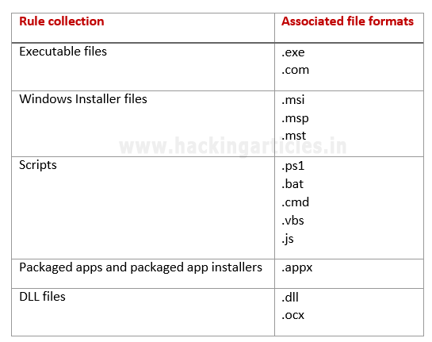

## Windows Applocker策略 - 初学者指南 [^1]

**Applocker简介**

- 什么是applocker政策？ [^2]
- 谁应该使用AppLocker？
  - 检查允许在公司网络内运行的应用程序
  - 检查允许哪些用户使用许可程序
  - 提供客户端运行的应用程序类型的审核日志
  - 防止追求新版的用户为每个用户安装软件
- 你的规则可以基于什么？ [^3]
- 

**配置Applocker以允许/拒绝执行应用程序** [^4]

- 配置执行规则	

  - ```bash
    Applocker>属性>-强制>全部配置[强制规则]>-高级>启用[DLL规则集合]
    ```

- 创建默认规则

  - ```
    Applocker>可执行规则>右击>创建新规则
    ```

**修改可执行的默认规则以允许应用程序**

- ```
  Applocker>可执行规则>右击>创建默认规则
  修改规则：右击>属性
  ```

- **允许：**您可以指定允许在您的环境中运行的文件，以及哪些用户或用户组

- **拒绝：**您可以指定哪些文件  *不*  允许运行在您的环境中，以及哪些用户或用户组

**规则条件** [^5]

- 出版者 [^6]

  - **优点：**

    - 不需要频繁更新。
    - 您可以在证书中应用不同的值。
    - 您可以使用单个规则来允许完整的产品套件。
    - 在发布者规则中，您可以使用星号（*）通配符来指定任何值应匹配。
  - **缺点** **：**
    - 虽然可以使用单个规则来允许完整的产品套件，但套件中的所有文件都必须统一签名

- 路径 [^7]

  - **优点** **：**

    - 可以轻松控制许多文件夹或单个文件。
    - 星号（*）可用作路径规则中的通配符。例如，`％ProgramFiles％\ Microsoft Office \ *`  表示Microsoft Office文件夹中的所有文件和子文件夹都将受规则影响。
  - **坏处：**
    - 如果组织使用文件夹路径的规则包含本地用户可写的子文件夹，则可能存在风险。

- 文件哈希 [^8]

  - **优势** **：**

    - 由于每个文件都有唯一的哈希值，因此文件哈希条件仅适用于一个文件。
  - **坏处：**
    - 每当文件更新（例如安全更新或升级）时，文件的哈希值都会发生变化。因此，您必须手动更新文件哈希的规则。

**修改Windows Installer默认规则以允许应用程序**

**Windows Installer默认规则类型包括：**

- 允许本地**Administrators** 组的成员  运行所有Windows Installer文件。
- 允许**Everyone** 组的成员  运行所有经过数字签名的Windows Installer文件。
- 允许**Everyone** 组的成员  运行位于Windows \ Installer文件夹中的所有Windows Installer文件

**创建阻止APP的新规则示例**

```
window10: cmd>secpol.msc>应用程序控制策略>AppLocker>可执行规则
右击>创建新规则
cmd>services.msc>服务(本地)>Application Identity>属性>启动类型（自动）>返回桌面
cmd>gpupdate(更新组策略)
```

[原文](https://www.hackingarticles.in/windows-applocker-policy-a-beginners-guide/)

---

[^1]: 本文基于“Microsoft Windows - Applocker Policy”并且是对于系统管理员的主题，为您的应用程序控制策略以及如何使用它们定义AppLocker规则。
[^2]: Windows Applocker是一个在家庭版Windows 7和Windows Server 2008 r2中引入的功能，作为限制不需要的程序使用的方法。Windows AppLocker==允许管理员控制拒绝或允许运行哪些可执行文件==。使用此策略，管理员可以根据文件的唯一标识上的文件名，发布者或文件位置生成规则，并指定哪些用户或组可以执行这些应用程序
[^3]: AppLocker控制台旨在规则集合中，其中包括可执行文件，脚本，Windows Installer文件，打包应用程序和打包的应用程序安装程序以及DLL文件。通过这些集合，您可以轻松区分不同类型应用程序的规则。下表列出了每个规则集合中包含的文件格式。
[^4]: window10: cmd>`secpol.msc`>应用程序控制策略>AppLocker>可执行规则>返回桌面>cmd>`services.msc`>服务(本地)>Application Identity>属性>启动类型（自动）>返回桌面>cmd>gpupdate(更新组策略)
[^5]: 规则条件是AppLocker标识规则适用的应用程序的标准，三个主要规则是文件的==发布者==，==路径==和==哈希==
[^6]: 标识基于数字签名的应用程序。数字签名包含有关创建应用程序的公司（发布者）的信息
[^7]: 在计算机文件系统或网络上按其位置标识应用程序。对于众所周知的路径，例如Program Files和Windows，AppLocker使用自定义路径变量
[^8]: 表示已识别文件的计算加密哈希系统。对于非数字签名文件，文件哈希规则比路径规则更安全