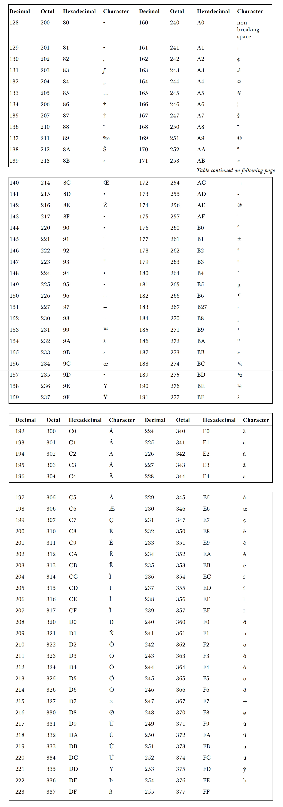

## CTF中常见的编码，代码混淆及加、解密

### 常见编码

1. #### ASCII编码 [^1]

   - ASCII非打印控制字符（参详ASCII码表中==0-31==）
   - ASCII打印字符，也就是CTF中常用到的转换 （参详ASCII码表中==32-127==）
   - 
   - 扩展ASCII打印字符（参详ASCII码表中==128-255==）[^7]
   - 
2. #### URL编码 [^2]

   - 示例
     - easy ---> `%65%61%73%79`
3. #### HTML实体编码 [^3]

   - 
   - 示例
     - easy  --- >  ` &#101;&#97;&#115;&#121`
4. #### Base编码 [^4]

   - 
   - 示例
     - easy ---> `ZWFzeQ==`
5. #### Unicode编码 [^5]

   - 示例
     - 源文本：The
     - &#x [Hex]：`&#x54;&#x68;&#x65;` 
     - &# [Decimal]：`&#84;&#104;&#101;`
     - \U [Hex]：`\U0054\U0068\U0065`
     - \U+ [Hex]：`\U+0054\U+0068\U+0065`
6. #### 莫尔斯电码**(Morse Code)**

   - 摩尔斯电码（又译为摩斯密码，Morse code）是一种时通时断的信号代码，通过不同的排列顺序来表达不同的英文字母、数字和标点符号。它的代码包括五种：点、划、点和划之间的停顿、每个字符之间短的停顿、每个词之间中等的停顿以及句子之间长的停顿
   - 此外常用的编码方式还有敲击码(Tap code)等。编码在电子计算机、电视、遥控和通讯等方面广泛使用。编码是信息从一种形式或格式转换为另一种形式的过程

### 常见的代码混淆 [^6]

1. #### Jsfuck

   -   jsfuck 源于一门编程语言 brainfuck，其主要的思想就是只使用8种特定的符号来编写代码。而jsfuck也是沿用了这个思想，它可以让你只用 6 个字符 `[]()!+` 来编写 JavaScript 程序
   - JSFuck可用于绕过恶意代码检测，且可以被用于跨站脚本攻击。因为缺乏原生JavaScript应有的特征，类似JSFuck的JavaScript混淆技术可帮助恶意代码绕过入侵防御系统或内容过滤器
   -   [在线平台](http://utf-8.jp/public/jsfuck.html)
2. #### Brainfuck

   -  Brainfuck 是一种极小化的计算机语言，目标是建立一种简单的、可以用最小的编译器来实现的、符合图灵完全思想的编程语言
   - BrainFuck 语言只有八种符号，所有的操作都由这八种符号( `> < + – . , [ ]`) 的组合来完成
   - [在线平台](https://www.splitbrain.org/services/ook)
3. #### Vbscript.encode

   -  VBScript.encode是针对asp代码进行的一种加密混淆操作
   -  [样题](http://ctf5.shiyanbar.com:8080/aspencode/)
   -  [在线平台](http://adophper.com/encode.html)
4. #### Jjencode

   - jjencode 将 JS 代码转换成只有符号的字符串，类似于 rrencode
   - aaencode 可以将 JS 代码转换成常用的网络表情，也就是我们说的颜文字 js 加密
   - [在线平台](http://utf-8.jp/public/aaencode.html)

### 加密

1. #### 古典加密算法

   1. ##### 凯撒密码

      - 是一种最简单且最广为人知的加密技术。它是一种替换加密的技术，明文中的所有字母按照按顺序进行 n 个字符错位转换后被替换成密文
      - 示例
        - ABCDE（偏移量为3）-->` DEFGH`

   2. ##### 栅栏密码

      -  把要加密的明文分成N个一组，然后把每组的第1个字连起来，形成一段无规律的话即为栅栏密码

      - ```
        明   文：The quick brown fox jumps over the lazy dog
        去空 格：Thequickbrownfoxjumpsoverthelazydog
        分   组：Th eq ui ck br ow nf ox ju mp so ve rt he la zy do g
        密   文：Teucbonojmsvrhlzdghqikrwfxupoeteayo
        ```

   3. ##### 培根密码

      - 又名倍康尼密码（Bacon’s cipher）是由法兰西斯·培根发明的一种隐写术，是一种替换密码，每个明文字母被一个由5字符组成的序列替换。最初的加密方式就是由‘A’和’B'组成序列替换明文

      - 示例：

        ```
        明文：THE DOG
        密文：baabb aabbb aabaa aaabb abbba aabba
        ```

   4. ##### 仿射密码

      - 仿射密码(Affine Cipher)是一种单表代换密码，字母表中的每个字母相应的值使用一个简单的数学函数映射到对应的数值，再把对应数值转换成字母。每一个字母都是通过函数`（ax + b）mod m`加密，其中B是位移量，为了保证仿射密码的可逆性，`a`和`m`需要满足`gcd(a , m)=1`，一般`m`为设置为 26

   5. ##### 维吉尼亚密码

      - 维吉尼亚密码（又译维热纳尔密码）是使用一系列凯撒密码组成密码字母表的加密算法，属于多表密码的一种简单形式。以其简单易用而著称，同时初学者通常难以破解，因而又被称为“不可破译的密码”。这也让很多人使用维吉尼亚密码来加密的目的就是为了将其破解

      - 

      - 示例

        - ```
          明文：THE QUICK BROWN FOX JUMPS OVER THE LAZY DOG
          密钥(循环使用，密钥越长相对破解难度越大)：CULTURE
          加密过程：如果第一行为明文字母，第一列为密钥字母，那么明文字母 `T` 列和密钥字母 `C` 行的交点就是密文字母 `V`，以此类推
          密文：VBP JOZGM VCHQE JQR UNGGW QPPK NYI NUKR XFK
          解密网站：https://www.qqxiuzi.cn/bianma/weijiniyamima.php
          ```

          

2. #### 现代密码学

   1. ##### 对称加密算法[^8]

   2. ##### HASH算法 [^9]

   3. ##### RSA算法

### 其他资料

-  [CTF中那些脑洞大开的编码和加密]( https://www.cnblogs.com/daban/p/5680451.html)
- [代码混淆的重要性](https://www.jdon.com/50072)
- [现代密码学]( https://www.cnblogs.com/WittPeng/p/8978737.html)
- [Code-现代密码学—原理与协议.pdf](archive.keyllo.com/L-编程/Code-现代密码学—原理与协议.pdf)
- [加解密工具合集站点](http://ctf.ssleye.com/)

[原文](https://www.freebuf.com/column/202057.html)

---

[^1]: ASCII编码大致可以分作**三部分**组成
[^2]: 又叫百分号编码，是统一资源定位编码方式。URL 地址(常说网址) 规定了常用地数字，字母可以直接使用，另外一批作为特殊用户字符也可以直接用(`/,:@`等)，剩下的其它所有字符必须通过`%xx `编码处理。编码方法很简单，在该字节 **ascii 码的的 16 进制**字符前面加`%`。 如空格字符，ascii 码是 32，对应16 进制是 ’20′，那么 urlencode 编码结果是:`%20`
[^3]: 一些字符在 HTML 中是预留的，拥有特殊的含义，比如小于号`<`用于定义 HTML 标签的开始。如果我们希望浏览器正确地显示这些字符，我们必须在 HTML 源码中插入字符实体。用一个编号写入HTML代码中来代替一个字符，在使用浏览器访问网页时会将这个编号解析还原为字符以供阅读 **Ref:** [HTML 实体符号参考手册](http://www.w3school.com.cn/tags/html_ref_entities.html)
[^4]: Base家族主要有Base16、Base32、Base64。Base64由大小写字母和数字，+/组成（=号用作填充字符），Base32则是只有大写字母和234567。其中Base64/32是网络上最常见的用于传输 8Bit 字节代码的编码方式之一。Base64编码是从二进制到字符的过程，可用于在HTTP环境下传递较长的标识信息。Base64编码保证了二进制数据的安全
[^5]: Unicode编码有以下四种编码方式
[^6]: 代码混淆(Obfuscated code)亦称花指令，**是将计算机程序的代码转换成一种功能上等价，但是难于阅读和理解的形式的行为**。代码混淆可以用于程序源代码，也可以用于程序编译而成的中间代码。执行代码混淆的程序被称作代码混淆器。目前已经存在许多种功能各异的代码混淆器。常用的代码混淆有jsfuck、brainfuck，Vbscript.encode加密等
[^7]: **针对扩展的ASCII码，不同的国家有不同的字符集，所以它并不是国际标准**
[^8]: DES,AES,RC4 等
[^9]: md5,sha1