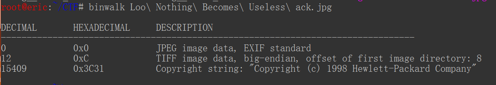
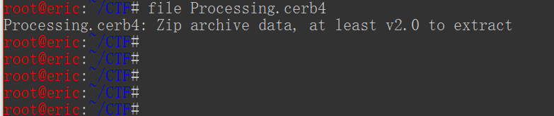

## skycoder - writeup

### [原题链接](https://ctflearn.com/problems/142)

### 查看文件中可识别字符得到三个有用信息

`strings Begin Hack.jpg`

1. `https://mega.nz/#!z8hACJbb!vQB569ptyQjNEoxIwHrUhwWu5WCj1JWmU-OFjf90Prg -N17hGnFBfJliykJxXu8 -`
2. `real_unlock_key: Nothing Is As It Seems`
3. `password: Really? Again`
4. `flag{Not_So_Simple...}`

看到`flag{Not_So_Simple...}`，难道就这么简单，尝试提交发现原来并没有这么简单，感觉智商受到了侮辱……:sweat:

从其他方式下手，我们下载链接并解压文件，得到两个文件`.Processing.cerb4`和`Loo Nothing Becomes Useless ack.jpg`

### 查看图片文件信息

​	同样拿到图片文件首先第一步就是查看它的可识别字符，这里我们看到没有什么可用信息，那么试试`exiftool`工具查看它的元信息，依然没有收获。这时我们注意到该图片文件大小为`81.7KB`，怀疑夹带私货，我们试着验证它

### 隐写工具

​	使用Kali平台的`binwalk`工具来搜索二进制文件中是否夹带文件或可执行代码。Google搜索TIFF格式、版权信息后结果不尽如意。这时只好转向另一个文件试试

### 验证文件类型

​	看到不认识的文件后缀首先想到的就是确定它的文件类型，同时也不要被它的拓展名迷惑，这里我们使用Kali平台的`file`工具检测文件类型，发现它原来是`zip`压缩文件

 	直接修改它的后缀后尝试解压，发现需要解压密码，这是熟悉的味道，出题人给你个压缩文件不搞个密码也说不过去……

​	好了，迄今为止我们得到的还没有用过的信息就是这两个了：`real_unlock_key: Nothing Is As It Seems`和`password: Really? Again`，看意思也就知道啥意思了。经过解压得到图片文件`skycoder.jpg`。采用固定的流程来获取它的信息，结果什么也没有

​	难道这也是个糊弄人的？不过想想也不可能，都给了获取解压密码这一关不可能什么信息也不提供。经过几个小时的琢磨后我吐血了，原来`flag`就在图片的右下角，不仔细查看还真是发现不了。好吧我承认还太嫩，不够细心

### 总结

​	虽然这是中等难度的CTF挑战，但实际操作起来还是一般的套路：

- 隐藏文件
- 文件格式混淆
- 隐写术（虽然这里没有用到）

记录下我的第一次CTF挑战，仍然感觉到需要了解它的套路，比如这次的flag的藏匿位置，经验老到的选手估计很快就会发现，即使我花费了无用的几个小时来解决问题，但最终最开心的事莫过于成功的喜悦，也抚慰了幼小的心