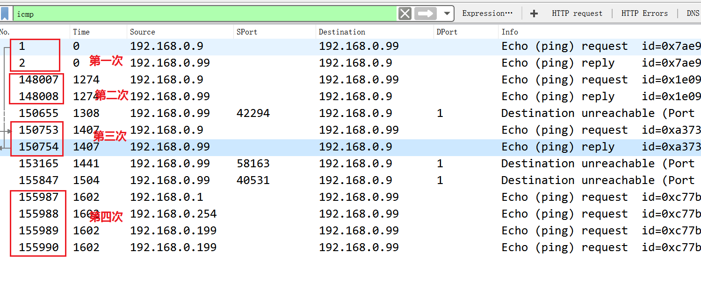

## SCAN - Writeup

### 题目内容

有人在内网发起了大量扫描，而且扫描次数不止一次，请你从capture日志分析一下对方第4次发起扫描是什么时候开始的，请提交你发现包编号的`sha256`值(小写)

### 文件

[SCAN.rar](https://static2.ichunqiu.com/icq/resources/fileupload/phrackCTF/misc/SCAN.rar)

### Wireshark 分析文件

1. 查看流量包中使用的协议类型

   通过`Protocol Hierarchy Statistics`视图我们知道截获的流量包中使用的协议有`UDP`、`TCP`和`ICMP`

   - 

2. IP地址信息

   通过`Conversation`视图我们知道`源IP（192.168.0.9）`使用TCP协议向`目的IP（192.168.0.99）`发送大量探测端口的数据包。此外还发现`源IP（192.168.0.254/192.168.0.1/192.168.0.199）`，查看它们的Mac地址可以知道来自同一个设备（IP地址欺骗）

   - 

3. 扫描结果

   理想情况下，我们可以根据`Conversation`视图下统计的`Packets`的个数，判断该端口是否开放，如果是3（TCP三次握手）可以认为该端口开放，但这是发生在网络状况良好，重传数据包很少的情况下

   在实际情况下我们可以采用较为保险的方法，通过Wireshark的过滤选项（`tcp.flags.syn == 1 && tcp.flags.ack == 1 && ip.src == 192.168.0.99 && !tcp.analysis.retransmission`）准确定位开放端口的数据包，结果开放端口包括：`22、111、32768、80、443、53 `

   - 

     

### IO Graphs

通过前面的步骤我们大致了解了数据流量相关的信息（虽然有些步骤在这里显得多余）。接下来我们根据题目给出的要求分析出：第4次发起扫描是什么时候开始的。这里我们使用`IO Graphs`视图可以完美的分析整体日志

图中出现比较明显的四个相似波峰，并且还发现四个波峰之间（蓝色线）大约间隔40s之间没有数据包的传输，因此我们可以大胆猜想攻击者的第四次发起扫描的时刻发生在图中红色方框的部分。这里因为日志流量中也使用了ICMP协议，我在这里添加了一个新的`Display Filter`，放大红色方框部分并定位到波峰出现的前面相邻部分（发起扫描之前）可以看到该时刻（1592s）没有发送任何数据包

定位该时间段（`frame.time_relative >= 1592 && frame.time_relative <= 1603 && ip.dst == 192.168.0.99`）的数据包，并过滤掉重传包，定位目的IP地址`192.168.0.99`的数据包

按理说应该是包编号为`155976`的数据包才是第四次扫描发出的第一个包，结果试出来的是编号为`155989`，不是很理解，难道是直接看`ICMP`协议??

如果接收方UDP发现收到的报文中的目的端口号不正确（即不存在对应于该端口号的应用进程，这里目标端口是1），就丢弃该报文，并由ICMP协议发送"端口不可达"差错报文给发送方。因为是扫描端口产生的日志流量，发送方故意使用一个非法的UDP端口，来达到测试的目的

