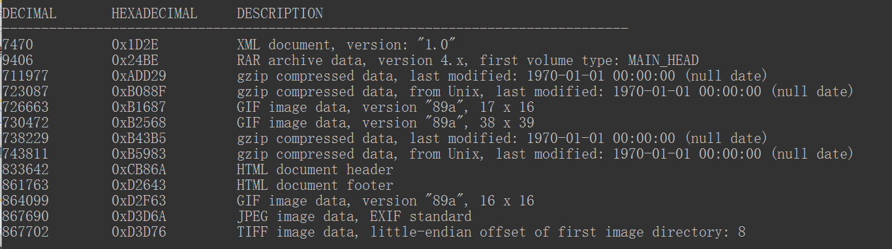
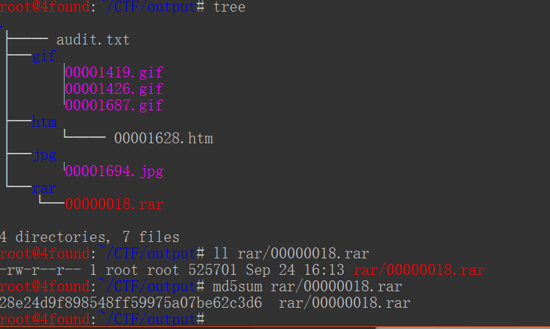
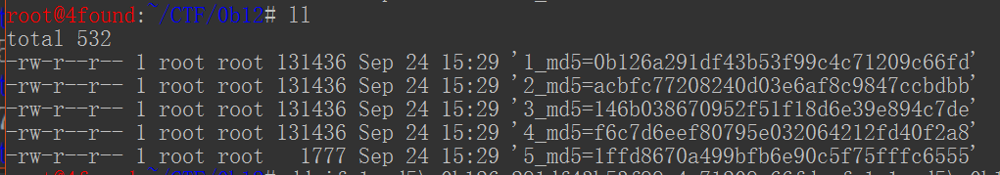

## 流量分析 2

### 题目

BugkuCTF [抓到一只苍蝇](https://ctf.bugku.com/files/58ae08bbd739136e19ff6138e49ae643/misc_fly.pcapng)

之所以记录下这次实验，是因为这道题考察的知识挺多，走过的弯路很多，遇到的问题也挺多，索性最后成功拿到Flag，不枉费我花费的时间

### 0x0 协议统计

拿到数据包做的第一件事固然是看看协议类型，着重注意TCP、HTTP协议。我们注意到使用HTTP协议传输的文件有许多：`xml`、`json`、`image-gif`等

`tshark -r misc_fly.pcapng -qz io,phs`

### 0x1 过滤

`tshark -r misc_fly.pcapng -Y http.request`

### 0x2 输出格式 [^1]

`tshark -r misc_fly.pcapng -Y "http.request" -T tabs`

表格形式输出的结果可以帮助我们较好的观察，我们可以看到流量中使用了`POST`和`GET`两种方式，为了进一步了解流量中传输的资源文件类型，我们可以过滤`http.request.uri` 确定访问的资源，结果可以看到有`gif`、`png`、`xml`文件，还有一些未知类型的数据，并且提供了md5值。看到这里的md5值就要多个心眼，估计就是让我们提取数据包并验证md5，避免有错

| 文件名 | md5                                |
| ------ | ---------------------------------- |
| 1      | `0b126a291df43b53f99c4c71209c66fd` |
| 2      | `acbfc77208240d03e6af8c9847ccbdbb` |
| 3      | `146b038670952f51f18d6e39e894c7de` |
| 4      | `f6c7d6eef80795e032064212fd40f2a8` |
| 5      | `1ffd8670a499bfb6e90c5f75fffc6555` |

在`Follow `12号数据包中，我们发现以下字段。因此可以认为这5个HTTP请求中传输的文件是`fly.rar`，其中`size`和`md5`值十分重要

```js
{
    "path": "fly.rar",
    "appid": "",
    "size": 525701,
    "md5": "e023afa4f6579db5becda8fe7861c2d3",
    "sha": "ecccba7aea1d482684374b22e2e7abad2ba86749",
    "sha3": ""
}
```

`tshark -r misc_fly.pcapng -Y http.request -T fields -e http.request.uri`

此外，使用`binwalk`工具可以提供更加详细的信息（数据流中夹带的文件）。同样的使用`foremost`工具可以迅速分离出数据流中传输的文件，不过这里就有点坑，使用`foremost`工具提取出的压缩文件虽然字节数也是`525701`，但是它的md5值却不一样，因此说明提取出的文件有问题。现在我们只能手动分离出压缩文件





### 0x3 分离文件

我们知道了流量包中文件类型是压缩文件，因此我们进行匹配后结果有5个HTTP请求包

`tshark -r misc_fly.pcapng -Y http.request -T tabs | grep /ftn_handler`

Wireshark打开流量包，`File`→`Expert Objects`→`HTTP`→`Save All`，然后删除不必要的文件，只留下5个带有md5值的文件并做了重命名



根据前面的信息提示压缩文件总大小`525701`字节，做简单的运算`131436*4+1777-525701)/5=364` ，因此去掉文件前`364`个字节就可以了

`dd if=input_file of=output_file bs=1 skip=364`

为了确定每一个文件没有错，进行md5校验就可以了，然后合并所有的文件

`cat 1 2 3 4 5 > fly.rar`

至此我们得到了准确无误的压缩文件`fly.rar`，然后使用压缩软件打开压缩包时提示文件错误，看来我们需要修改里面某些字段，我们使用 010 Editor软件打开（具有文件脚本分析工具），根据输出面板提供的消息看到`Block #3`（文件头）段里的 `HEAD_CRC`值与`crcCheck`值不匹配，将`HEAD_CRC`值修改为`crcCheck`值就可以看到里面的文件`flag.txt`，接着尝试解压发现还有密码。嗯~，在多次寻找之后没有发现类似密码的信息，这里只能试试该压缩文件是否是伪加密，RAR的文件格式分析可以参考[这里](https://ctf-wiki.github.io/ctf-wiki/misc/archive/rar-zh/)或[这里](https://max.book118.com/html/2019/0317/7135014030002014.shtm)，修改对应的字段值后发现可以解压，不过在此之前还要修改下`HEAD_CRC`的值（因为修改了`HEAD_CRC`值，`crcCheck`值也改变了），至此我们得到了`flag.txt`文件，离成功更近了一步

### 0x4 文件类型

`file flag.txt` [^2]

原来是PE文件，将文件后缀名修改为`.exe`，程序运行时出现许多苍蝇，也倒是点题了。剩下的工具也就查看文件中有什么猫腻，丢到`binwalk`工具里看到文件中夹着PNG文件，使用`foremost`工具提取出图片文件就可以拿到flag

### 总结

1. 刚开始使用`foremost`工具确实可以很简单的提取出文件，但在解压文件时总会出现错误，导致程序执行不成功。因此在检查压缩文件，分析格式上花费了许多的无用功。在此看来还是不要过分依赖工具，在某些情况下还是要自己分析
2. 通过 `WinMerge `工具比对 `foremost `提取的文件与人工提取的文件有许多不同。经过简单分析结果是：`foremost `工具提取的文件中包含正确的文件内容，只不过在每段前面多了一些字节。大致原因也许是匹配到RAR文件头信息（MAIN_HEAD），直接将后面的字节数截取出来，却没有删减掉其中的数据包中协议信息


---

[^1]: `-T` 指出解析时输出的格式；默认`text`；其他选项 ：/fields (需要增加`-e`参数)或者`ek|json|jsonraw|pdml|ps|psml|tabs`

[^2]: 结果返回`flag.txt: PE32 executable (GUI) Intel 80386, for MS Windows`