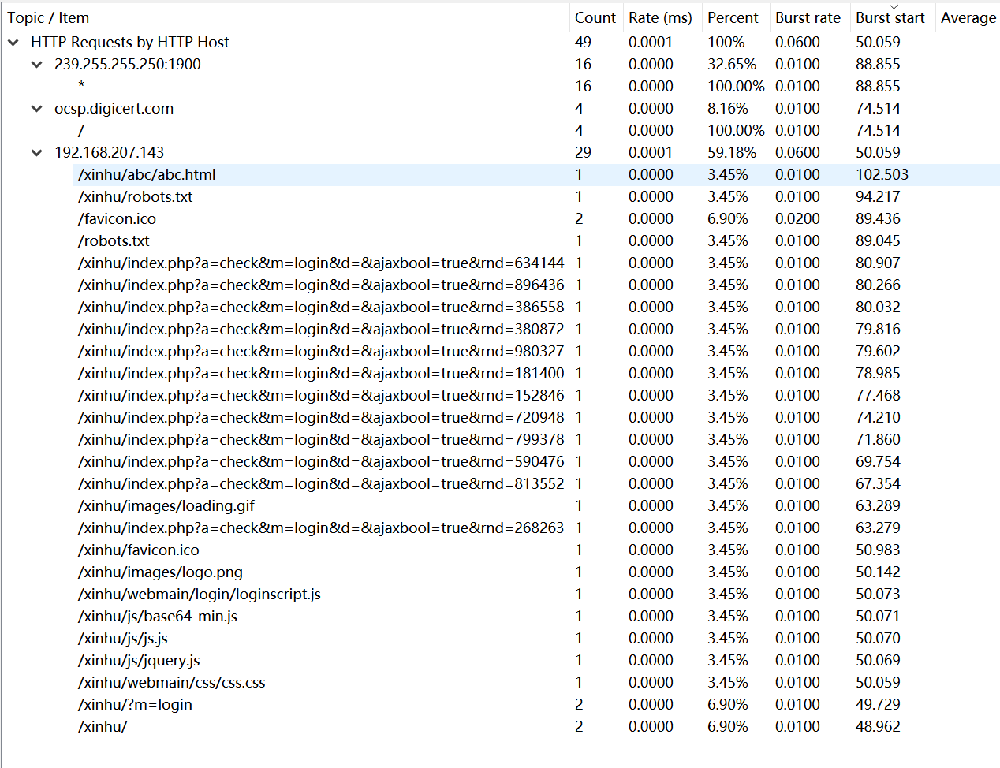
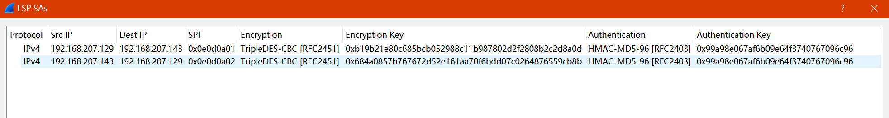

### 0x0 基础分析

1. 源/宿地址 [^1]

   判断源/宿地址比较容易，根据Wireshark的统计功能即可判断：`Statistics`→`Conversations`→`TCP`，一般位于`Address A`的地址就是源地址。当然如果不放心，可以过滤`http.request`查看发起请求的一方

2. 协议统计  [^2]

   使用的协议有很多，我们可以根据传输数据包的多少进行高低排序，把主要的注意力放在流量多的一方。当然，我们得首先查看`HTTP`协议

3. HTTP请求 [^3]

   

   逐个分析请求流，发现最有价值的是`/xinhu/abc/abc.html`。继续跟进得到以下重要信息

   ```
   md5 0x99a98e067af6b09e64f3740767096c96
   DES 0xb19b21e80c685bcb052988c11b987802d2f2808b2c2d8a0d	(129->143)
   DES 0x684a0857b767672d52e161aa70f6bdd07c0264876559cb8b	(143->129)
   ```

### ox1 提取文件

我们知道数据流中传输的文件名称，即使根据它的名称认为没有什么作用，但是为了消除迷惑的可能性还是应该将这些文件提取出来，较为快速的方法就是使用`foremost`工具

### 0x2 Wireshark解密ESP

继续向下分析，发现都是 IPSec 加密后的流量（`ESP`），范围在`786~1583`。接下来我们就需要使用 Wireshark 解密数据流量，定位到`Preferences`→`Protocols`→`ESP（Encapsulating Security Payload）`→`ESP SAs`，填写以下信息之后就可以看到解密后的信息



### 0x3 编写脚本

比较有意思的是发现在部分 http 请求中夹杂 ASCII 码，因此进行转码就可以得到 flag

```python
s = [102,108,97,103,123,50,55,98,48,51,98,55,53,56,102,50,53,53,50,55,54,101,53,97,57,56,100,97,48,101,49,57,52,55,98,101,100,125]
s1 = ''
for i in range(len(s)):
	s1 += chr(s[i])
print(s1)
```

### 0x4 总结

1. ASCII 码藏在 HTTP 请求中，需要进行转码
2. 可以使用 Wireshark 对加密的流量进行解密，并且需要填写秘钥等信息

### Ref.

- [Wireshark ESP_Preferences](https://wiki.wireshark.org/ESP_Preferences)
- [IPSec VPN详解](https://wenku.baidu.com/view/384e5dc548649b6648d7c1c708a1284ac85005b0.html)


---

[^1]: 源地址：`192.168.207.129`；宿地址：`192.168.207.143`

[^2]: `Statistics`→`Protocol Hierarchy`

[^3]: 显示较为明确的方法：`Statistics`→`HTTP`→`Requests`
