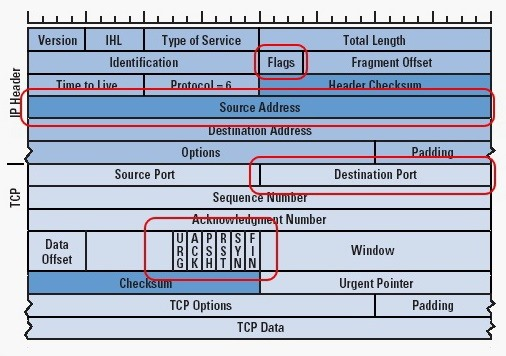

## Digital Forensics , Part 10 (Identifying Signatures of a Port Scan & DoS Attack)

### Get the Basic Knowledge （wireshark）

- [wireshark系列教程](https://tag.wonderhowto.com/wireshark/)
- [熟悉TCP/IP数据包结构](https://null-byte.wonderhowto.com/news/hacker-fundamentals-tale-two-standards-0133727/)
- 

### Nmap Scan Signature [^1]

`nmap -sS -P0 192.168.1.103 -p0-1521`

### DoS Syn Flood Signature [^2]

`hping3 --rand-source -f -S 192.168.1.103 -p80 --flood` 

- `--rand-source`: 随机源IP地址
- `-f`: 对数据包进行分段，使其更有可能通过安全设备
- `-S `: 发送SYN数据包以创建半开连接
- `192.168.1.103` : 是目标IP地址
- `--flood` : 尽可能快地发送数据包

### Result

- 每个数据包来自不同的IP地址
- 每个数据包之间的时间间隔很短 - 只有几千秒
- 没有设置标志（flags）位，这是恶意流量的明显标志，因为正常流量会设置这些标志中的任何一个
- 所有TCP标志都设置为SYN。没有ACK，RST，FIN

[原文](https://null-byte.wonderhowto.com/how-to/hack-like-pro-digital-forensics-for-aspiring-hacker-part-10-identifying-signatures-port-scan-dos-attack-0164805/)

---

[^1]: 我们假设攻击者在扫描时有点谨慎，使用不会自动记录其IP 的[SYN扫描](https://null-byte.wonderhowto.com/how-to/hack-like-pro-conduct-active-reconnaissance-and-dos-attacks-with-nmap-0146950/)（这些通常被称为隐形扫描或半开扫描）
[^2]: 使用 [Hping3](https://null-byte.wonderhowto.com/how-to/hack-like-pro-conduct-active-reconnaissance-your-target-with-hping3-0148092/) 工具构造SYN数据包进行泛洪攻击。由于我们不需要与DoS建立TCP连接，因此我们可以欺骗我们的IP地址，使调查人员很难追踪攻击源。此外，许多防火墙，入侵检测系统和其他安全设备旨在将在一段时间内发送过多数据包的IP地址列入黑名单。通过随机更改每个数据包的IP地址，它将在很大程度上打败这种安全措施。SYN泛洪用于创建许多未完成的服务器半连接。这里的想法是用尽连接队列中的所有连接，以便其他合法用户无法连接到服务器