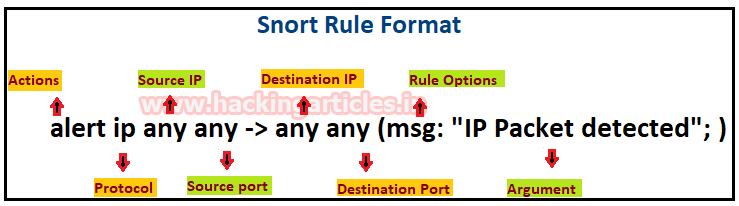

## Snort综合指南（第1部分）[^1]

### IDS简介 [^2]

### IDS的类别

- #### 基于签名的IDS （Signature-Based IDS） [^3]

- #### 基于异常情况的IDS（Anomaly IDS）[^4]

### IDS的类型

- #### NIDS [^5]

- #### HIDS [^6]

### snort简介 [^7]

### 安装Snort

`apt-get update`

`apt-get upgrade`

`sudo apt-get install snort`

### 配置

`vim /etc/snort/snort.conf` [^8]

### 启用snort的IDS模式

`sudo snort -A console -i ens33 -c /etc/snort/snort.conf`

`sudo snort -A console -i wlan0 -c /etc/snort/snort.conf`

### 编写snort规则

`cd etc/snort/rules & ls -la`

- `cat /dev/null > icmp.rules & cat icmp.rules`
- `cat /dev/null > icmp-info.rules & cat icmp-info.rules`

在 ==`local.rules`==文件中写入以下规则

`alert icmp any any -> 192.168.1.21 any (msg: "ICMP Packet found"; sid:10000001; )`

`alert icmp any any <> 192.168.1.21 any (msg: "ICMP Packet found"; sid:10000001; )`

`alert tcp any any -> any 21 (msg: "FTP Packet found"; sid:10000002; )`
`alert tcp any any -> any 22 (msg: "SSH Packet found"; sid:10000003; )`
`alert tcp any any -> any 80 (msg: "HTTP Packet found"; sid:10000003; )`

激活`snort`以捕获恶意数据包

`sudo snort -A console -q -u snort -g snort -c /etc/snort/snort.conf -i ens33` [^9]

[原文](https://www.hackingarticles.in/comprehensive-guide-on-snort-part-1/)

---

[^1]: 本文将介绍使用Snort作为示例来理解IDS的指南
[^2]: DS代表入侵检测系统。建立IDS的技术和方法用于监视和揭示主机和网络级别的恶意活动。一旦所述活动发生，则发出警报以意识到每次攻击。它可以是硬件或软件，也可以是两者的组合; 取决于要求。IDS同时或单独使用基于签名或异常的技术; 再次根据要求。您的网络拓扑确定了入侵检测系统的添加位置。是否应将其定位在一个或多个位置取决于您是否要跟踪内部威胁或外部威胁。例如，如果您想保护自己免受外部流量的影响，那么您应该在路由器上放置IDS如果您想保护内部网络，请将IDS放在每个网段上。
[^3]: 此 IDS 验证网络流量中数据包的签名
[^4]: 此IDS通常会检测数据包是否表现异常
[^5]: NIDS代表网络入侵检测系统。这些类型的IDS将捕获在网络中接收和发送的数据包，并从签名数据库中计算这些包。如果数据包是匹配的，那么将不会发出警报，否则它将发出警报，让每个人都知道恶意攻击。Snort是NIDS的一个很好的例子。
[^6]: HIDS代表主机入侵检测系统，它显然是主机。此类IDS监控系统和应用程序日志以检测入侵者活动。某些IDS会在发生某些恶意活动时做出反应，其他IDS会监控进入安装了IDS的主机的所有流量，并实时发出警报。
[^7]: Snort是一种网络入侵检测系统（NIDS）。它非常受欢迎，是一种开源软件，可以帮助实时监控网络流量，因此它也可以被视为数据包嗅探器。基本上，它会检查深入每一个数据包，看看是否有是任何恶意的有效载荷。它还可以用于协议分析和内容搜索。它能够检测端口扫描，缓冲区溢出等各种攻击。它适用于所有平台，如Windows， Linux 等。它不需要对系统或硬件进行任何重新编译添加到您的发行版; 但是需要root权限。它根据提供的规则集检查所有网络流量，然后向管理员发出有关任何可疑活动的警报。它分为多个组件，所有组件协同工作以检测入侵。以下是snort的主要组件：**分组解码器**、**预处理器**、**检测引擎**、**记录和警报系统**、**输出模块**。
[^8]: `ipvar HOME_NET 192.168.1.21` ＃设置您正在保护的网络地址(也就是安装的主机ip)
[^9]: **-A**  设置警报模式：快速，完整，控制台，测试或无；**-q**  代表安静，不显示横幅和状态报告。；- **u** 以<uname>用户身份运行snort uid；**-g**  以<gname>组（或gid）的身份运行snort gid；**-c**  <rules>使用规则文件；**-i**  监听界面