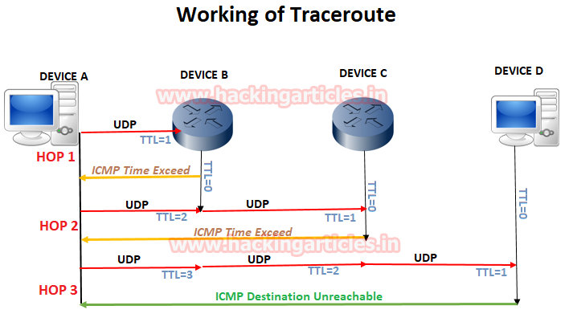

## 使用Wireshark工作 Traceroute [^1]

### **Traceroute的工作**

### **跟踪Wireshark的Tracert **[^2]

`tracert 8.8.8.8`

`tracert -d 8.8.8.8` [^3]

**在Wireshark，我们注意到以下几点：**

- 使用ICMP echo请求包代替UDP来发送DNS查询。
- 数据包首先从源192.168.1.101到达第一个路由器192.168.1.1，其中包含TTL = 1的ICMP回应请求数据包
- 路由器将丢弃该数据包并向源发送ICMP Time Exceeded错误消息。
- 所有这些在源机器通过将TTL值递增1（即TTL = 2）发送下一个数据包之前发生3次。

### **使用Wireshark跟踪路由（通过UDP数据包）** [^4]

`traceroute 8.8.8.8`

### **使用Wireshark跟踪路由（通过ICMP数据包）**

`traceroute -I 8.8.8.8`

### **使用Wireshark跟踪路由（通过TCP数据包）**

`tcptraceroute - 8.8.8.8`

`tcptraceroute google.com`

`traceroute -T 8.8.8.8`

[原文](https://www.hackingarticles.in/working-of-traceroute-using-wireshark/)

---

[^1]: **Traceroute或Tracert**：它是一种基于CUI的计算机网络诊断工具，分别用于UNIX和类Windows系统。它通过计算每跳的平均时间来跟踪从源计算机到Internet主机（如Google.com）的数据包路径。Traceroute通过利用ICMP的消息将UDP数据包发送到目的地。它使用ICMP错误报告消息-Destination Unreachable和Time exceeded。**星号（\*）：**表示探测超时，这意味着该跳的路由器不响应由于防火墙过滤器而从用于traceroute的源接收的数据包。
[^2]: tracert是用于Windows系统的CLI实用程序，用于跟踪从源到目标的数据包路径。因此，在以下命令的帮助下，我们可以观察到达谷歌DNS的数据包的路径.**语法：** tracert [options]主机IP
[^3]: **注意：** tracert的结果每次跳数都会有所不同，但不超过30跳，因为它是最大跳数限制。
[^4]: traceroute用于Unix的实用程序 - 类似于系统跟踪数据包从源到目的地的路径。因此，在以下命令的帮助下，我们可以观察数据包传输到达Google DNS的路径