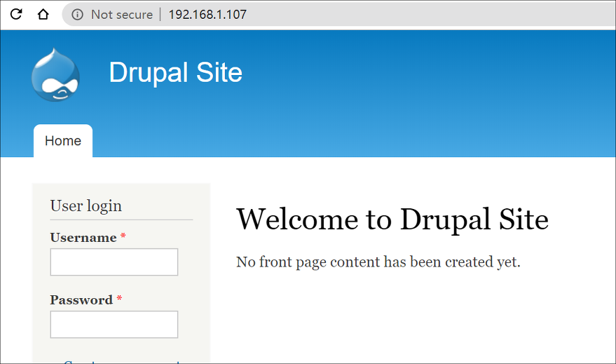
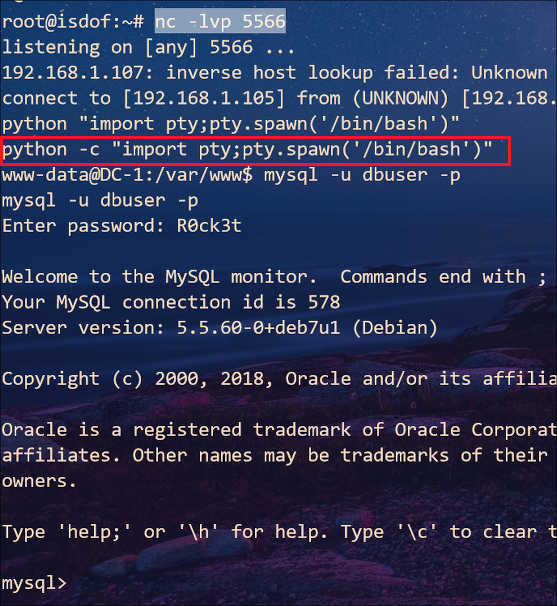

## DC-1 : Walkthrough

### 主机识别

`nmap -sn 192.168.1.1/24`

### 网络拓扑

| 计算机        | IP              |
| ------------- | --------------- |
| 本机（Win10） | `192.168.1.108` |
| Kali          | `192.168.1.105` |
| DC-1          | `192.168.1.107` |

### 扫描端口和版本信息

`nmap -A 192.168.1.107`


### 访问Web并确定web应用

根据 Nmap 扫描结果可知，根目录存在 **robots.txt** 




从该文本可以看出网站根目录下有许多子目录，基于网站模板搭建，并且可以确定运行在 Web 上的应用是**Drupal**。至于版本号，我们可以使用 `curl` 收集网站 *Banner* 信息


使用 Kali 平台下 `searchsploit` 搜索可利用的 *exploit*


当然也可以在 MSF 中搜索可利用的 *exploit*，我采用第4个 *exploit*


### Getshell 


切换到可交互 `bash shell`，在 `/var/www/` 目录下存在第一个 flag 文件（**`/var/www/flag1.txt`**）

```
Every good CMS needs a config file - and so do you.
```

通过常规手段，我们也很容易找到另一个 flag 文件（**`/home/flag4/flag4.txt`**）

```
Can you use this same method to find or access the flag in root?
Probably. But perhaps it's not that easy.  Or maybe it is?
```

继续执行以下命令，在本目录下递归查找文件中存在 flag 字符串的文件

`grep -R -E flag[[:digit:]] ./`

命中一条记录 `./sites/default/settings.php`


文件中记录了 mysql 数据库的用户名和密码，不妨进去看看。不过后来为了解决不能回显 mysql 输出结果的问题却是耗费了我很多时间，所幸在网上找到解决问题：

1. 使用 `nc` 建立 shell 到 Kali
2. Kali 监听端口，并执行 `python -c "import pty;pty.spawn('/bin/bash')"`


Kali 监听 **5566** 端口



在数据库 `drupaldb`→ `field_data_body`表 → `body_value`列中找到一条重要信息（PS：藏得可真深）


提示我们使用 `find` 命令寻找特殊权限 SUID


发现 `find `命令本身就具有 SUID 权限，那么就可以使用 `-exec` 参数执行命令


至此找到最后一个 flag 文件（**`/root/thefinalflag.txt`**）

```
Well done!!!!

Hopefully you've enjoyed this and learned some new skills.

You can let me know what you thought of this little journey
by contacting me via Twitter - @DCAU7
```

### Ref.

- [Medium](https://link.medium.com/PvhdfsaTh6)

