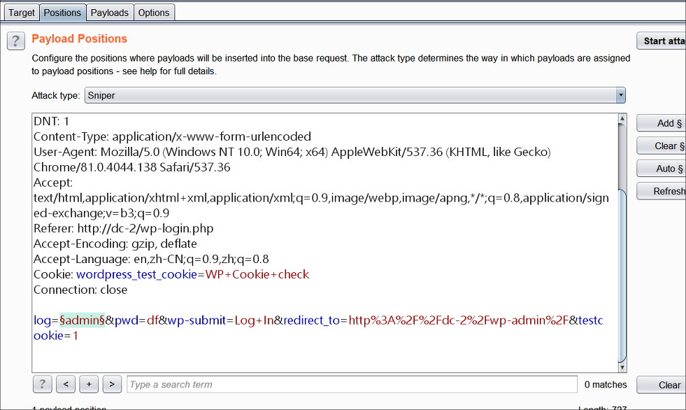

## DC-2 : Walkthrough

### 主机识别

`nmap -sn 192.168.1.1/24`

### 网络拓扑

| 计算机        | IP              |
| ------------- | --------------- |
| 本机（Win10） | `192.168.1.108` |
| Kali          | `192.168.1.105` |
| DC-2          | `192.168.1.113` |

### 扫描端口和版本信息

`nmap -A 192.168.1.113`

> 使用 `-A` 参数只能扫描常规端口，添加 `-p-` 参数扫描全部端口


### 访问Web并确定web应用

设置 *hosts* 文件，并且根据 Nmap 扫描结果可知，web 应用程序运行 WordPress 4.7.10


在首页选项我们找到 **flag 1**

```
Your usual wordlists probably won’t work, so instead, maybe you just need to be cewl.

More passwords is always better, but sometimes you just can’t win them all.

Log in as one to see the next flag.

If you can’t find it, log in as another.
```

> 根据字面意思是需要使用 `cewl` 工具获得密码字典，并且 Kali 平台默认安装。通过查看 `man` 手册得知该工具主要作用是爬取给出的 URL，返回一系列用于密码爆破的文本。命令执行 `cewl http://dc-2/ -w dc2.txt`

接下来找到 WordPress 默认登录页面，尝试常见用户名 *admin*，根据给出的信息得知存在该用户。这里可以进行爆破，找到存在的用户


如下图设置，并且使用 [SecList](https://github.com/danielmiessler/SecLists) 字典集中 *Usernames* 部分的 *xato-net-10-million-usernames-dup.txt* 字典



经过一段时间的爆破，找到三个用户：*admin*、*jerry*、*tom*


现在我们已经有用户名和密码字典，因此下一步就是进行密码爆破


分别设置**payload 1** 选择 Simaple list，**payload 2** 选择 Runtime file


因此我们得到两个账户和密码：`tom:parturient`、`jerry:adipiscing`。使用两个账户分别登录 WordPress，在 *jerry* 账户下我们得到 **flag 2**


```
If you can't exploit WordPress and take a shortcut, there is another way.

Hope you found another entry point.
```

### SSH 登录

使用 *tom* 账户和密码进行 ssh 登录 `ssh tom@192.168.1.113 -p 7744`。发现当前 shell 是 *rbash*，并且无法使用常规的命令，因此我们需要切换到 *bash* shell

> `rbash` 是一个 Unix shell，它限制了交互式用户会话或者在它内部运行的shell script 的某些功能，限制执行完全不受信任的软件


根据网上找到的[文章](https://www.cnblogs.com/xiaoxiaoleo/p/8450379.html)，进行 *rbash* 绕过


得到 **flag 3** 

```
Poor old Tom is always running after Jerry. Perhaps he should su for all the stress he causes.
```

使用 *jerry* 账户和密码进行 ssh 登录 `ssh jerry@192.168.1.113 -p 7744`，发现权限不够。那么就在 *tom* 账户下进行账户切换


得到 **flag 4** 

```
Good to see that you've made it this far - but you're not home yet.

You still need to get the final flag (the only flag that really counts!!!).

No hints here - you're on your own now.  :-)

Go on - git outta here!!!!
```

### 提权

根据提示，我们还有最后一个 flag，并且需要用到 *git* 工具。通过执行 `sudo -l`来查看用户允许执行的命令，根据输出信息我们知道可以无密码使用 *root* 账户下的 git 命令


因此，通过执行 `sudo git -p help -a` 打开 git 手册，然后在命令行模式下执行 `!/bin/sh` 切换到 *sh* shell，这样我们就可以切换到 *root* 账户下，得到最后一个 flag 


### 总结

1. 在 WordPress 后台面板通过新建文章写入后台 *shell.php* 发现并不能成功，并且使用 `img` 标签也是，原因如这篇[文章](https://segmentfault.com/q/1010000002643218)所说，此外也没有安装任何插件，因此这条路走不通

2. WordPress 4.7.10 版本虽有[许多漏洞](https://wpvulndb.com/wordpresses/4710)，比如[RCE](https://blog.ripstech.com/2019/wordpress-image-remote-code-execution/)，但利用起来比较复杂。因此作为替补方案

3. 在进行 WordPress 账户、密码爆破时，也可以使用 *hydra* 命令行工具操作：

   ```
   hydra -L user.txt  -P dc2.txt dc-2 http-form-post '/wp-login.php:log=^USER^&pwd=^PASS^&wp-submit=Log In&testcookie=1:S=Location'
   ```

   

### Ref.

- [csdn](https://blog.csdn.net/wang_624/article/details/90556462)

