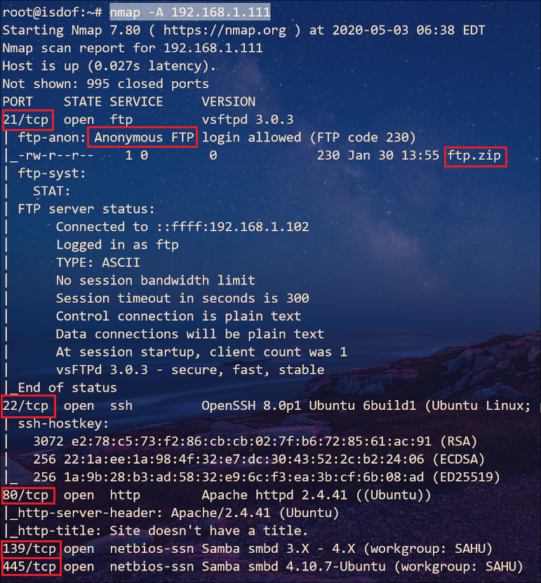
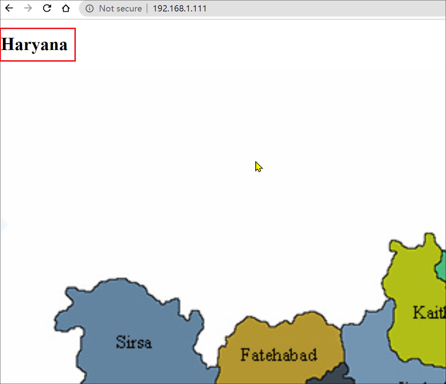
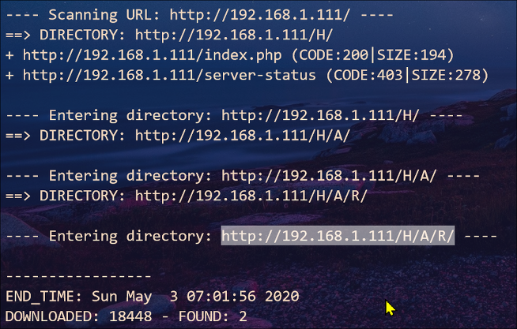
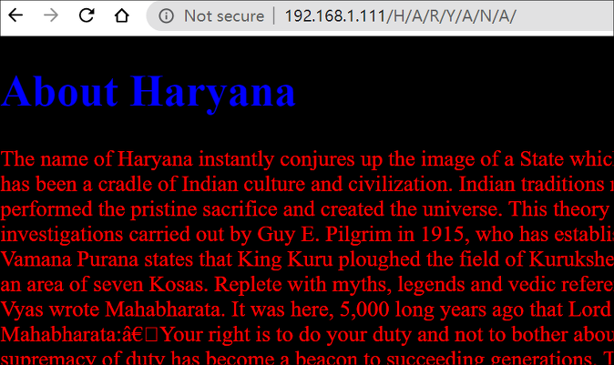
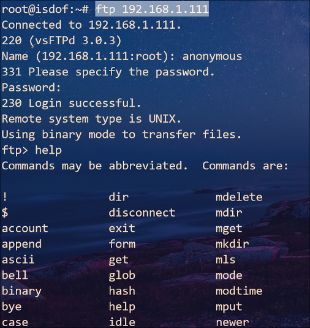
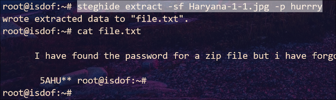
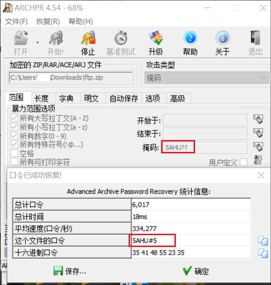
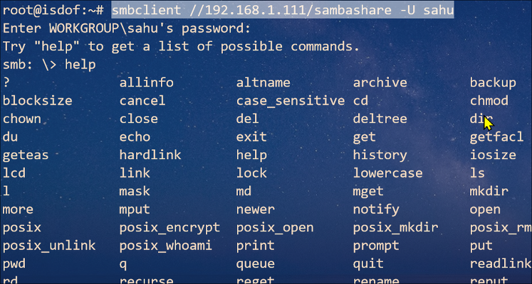
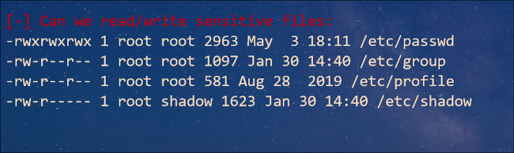
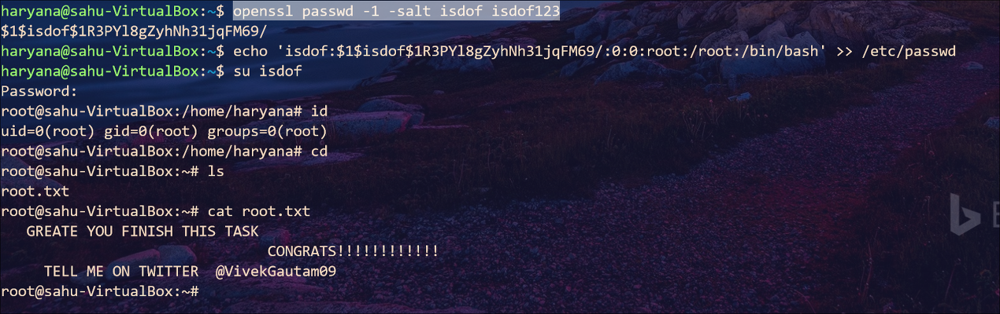

## Sahu: Walkthrough

### 主机识别

`nmap -sn 192.168.1.1/24`

### 网络拓扑

| 计算机 | IP              |
| ------ | --------------- |
| Kali   | `192.168.1.102` |
| Sahu   | `192.168.1.111` |

### 扫描端口和版本信息

`nmap -A 192.168.1.111`



### 访问Web并确认web应用

访问 *80* 端口我们看到有张地图图片，此外查看网页源码也没什么发现。接下来就通过扫描器枚举服务器目录





访问该链接却返回 *403 Forbidden*，根据这三个字母发现一些端倪，我们试着首页 **Haryana** 补全链接，发现可以正常访问



>  `Ctrl+U` 查看源码发现第一条重要信息：`try to extract with hurrry`

### 访问 FTP 服务器

根据 Nmap 扫描我们知道 FTP 目录下有个 *ftp.zip* 压缩包，并且启用了匿名登录



输入 `ftp:[none]` 账号（`ftp`）密码（空）登录 FTP 服务器，执行`ls`命令查看当前目录，并使用`get`命令下载文件到本地。经过尝试是个加密过的压缩包，使用 *hurrry* 解压密码并不成功。后来想到 *extract* 这个词常见于CTF中的图片隐写，试试 *steghide*

```
wget http://192.168.1.111/Haryana-1-1.jpg
steghide extract -sf Haryana-1-1.jpg
```



根据解压出的内容，得到了一部分解压密码，很明显下一步就是掩码爆破



不过我们也可以在 Linux 平台使用 `crunch` 制作字典

```
crunch 6 6 -t 5AHU@, > dict.txt
crunch 6 6 -t 5AHU@^ >> dict.txt
crunch 6 6 -t 5AHU@% >> dict.txt
crunch 6 6 -t 5AHU%^ >> dict.txt
crunch 6 6 -t 5AHU,% >> dict.txt
crunch 6 6 -t 5AHU^@ >> dict.txt
crunch 6 6 -t 5AHU^% >> dict.txt
```


>  得到第二个重要信息：
>  ```
>  USERNAME = sahu
>  PASSWORD = sahu14216
>  ```

### 访问 SMB 服务

namp 扫描显示虚拟机开启了139（SMB）端口，使用 `enum4Linux` 来枚举 SMB 服务


下一步使用 `smbclient` 建立连接



使用 `get` 命令下载 *ssh.txt* 文件

> 得到第三个重要信息：
>
> ```
> ssh users list
> USERNAME = haryana
> PASSWORD = hralltime
> ```

### SSH 连接虚拟机

接下来的工作就是提权，读取 */root* 目录下的文件。在此之前运行 [LinEnum.sh](https://github.com/rebootuser/LinEnum) 脚本来收集信息



因此我们可以通过在 *passwd* 文件里添加新用户来取得 *root* 权限



### Ref.

- [hackingarticles.in](https://www.hackingarticles.in/sahu-vulnhub-walkthrough/)
- [privilege-escalation](https://www.hackingarticles.in/editing-etc-passwd-file-for-privilege-escalation/)

