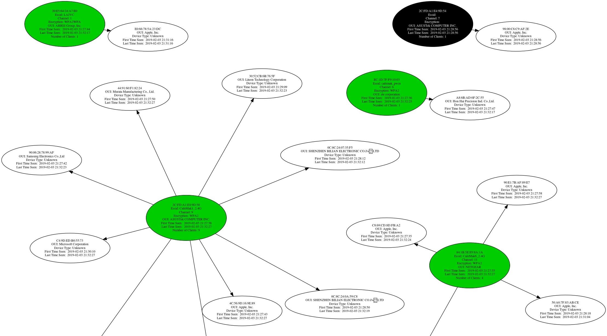
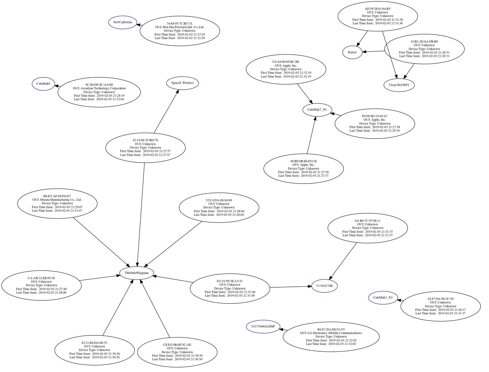

## 使用Airgraph-Ng监视网络关系 [^1]

### Kismet [^2]

### Airgraph-ng [^3]

- 收集：Airodump-ng [^4]
- 处理：Airgraph-ng [^5]

### Install

`apt-get update && apt-get upgrade`

`apt-get install aircrack-ng`

### Plug in Your Card & Enable Monitor Mode

`airmon-ng start wlan0`

### Run Airodump-Ng & Save CSV File

`airodump-ng wlan0mon -w capturefilename`

### Generate a Graph of AP Relationships (Connected Devices)

`airgraph-ng -i ./capturefilename.csv -o CAPR.png -g CAPR` 

### Generate a Graph of  Probe Frames (Disconnected Devices)

`airgraph-ng -i ./capturefilename.csv -o CPG.png -g CPG`

### Interpret the Results  [^6]

[原文](https://null-byte.wonderhowto.com/how-to/spy-network-relationships-with-airgraph-ng-0193309/)

---

[^1]: 查看附近的每个Wi-Fi设备连接到哪个接入点
[^2]: 能够发现并监视连接到附近网络Wi-Fi网络的任何设备的Wi-Fi活动
[^3]: 了解附近网络的地形并将结果显示为图表，我们需要收集并处理数据
[^4]: 使用无线网络适配器拦截的Wi-Fi数据包“转储”到文件中，此CSV文件将允许我们轻松处理我们发现的内容并生成显示检测到的关系的PNG图
[^5]: 第一种类型的图是**CAPR**或客户端访问点关系图。此图显示当前连接到接入点的每个设备的映射以及它们当前连接到的网络。第二种图表 **CPG** 向我们显示了当前未连接到接入点的W-Fi设备呼叫的网络名称。这可以揭示我们可以创建的网络列表，以吸引附近的设备进行连接。
[^6]: 对于黑客或渗透测试人员，前两个图表提供了重要信息。首先，我们能够看到每个附近设备连接到哪个接入点，如果我们识别目标，我们就可以将客户端隔离或捕获到假的MITM网络上。因此，我们可以创建设备当前连接到的网络的虚假版本，将它们从真实网络中踢出，并使它们自动连接到虚假版本。在第二个图中，我们能够识别出我们可以创建的网络，这些网络会导致几个不同的设备连接。这些图表还可以显示使用MAC地址随机化的设备，因为即使是更改其MAC地址的设备也可能会呼叫具有唯一名称的网络，因为它们会继续更改其MAC。黑客可以使用有关存在的硬件类型及其连接方式的信息来制定针对网络的攻击计划。由于此攻击完全是被动的，并且不需要与网络进行交互，因此几乎不存在被窥探这些信息的风险。