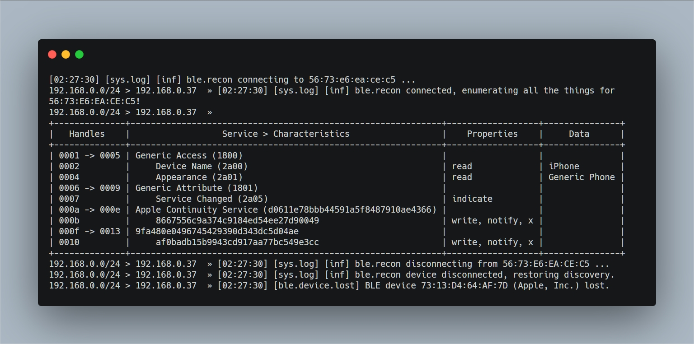
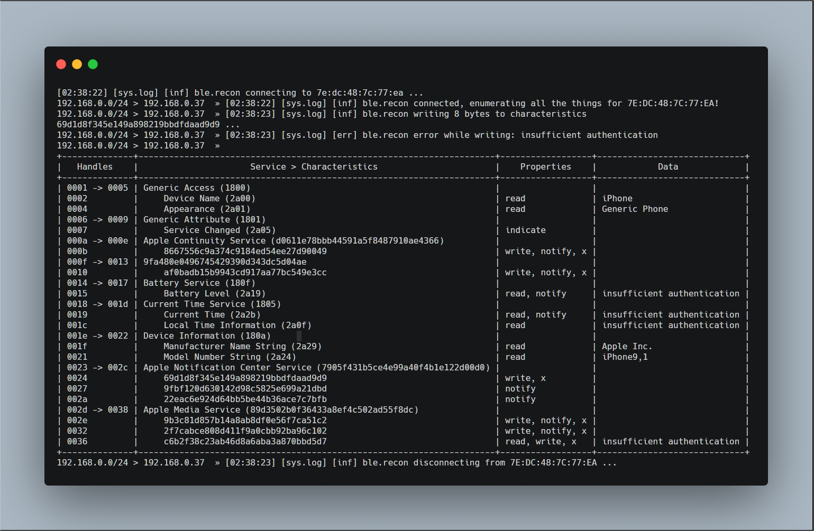

## Target Bluetooth Devices with Bettercap

### What Kind of Devices Use Bluetooth

- 智能跟踪设备寻找丢失的物品
- 笔记本电脑和智能手机等设备
- 许多制造商没有选择利用MAC地址随机化保证设备安全性，导致这些蓝牙设备在任何地方广播相同的MAC地址

### Bettercap for Bluetooth

- Bettercap 的前身是 Ettercap，具有针对许多不同类型的无线电和网络技术的攻击模块
- Bettercap还可以搜索并攻击Wi-Fi网络，默认情况下，当您启动时，它将开始枚举您所在网络上的设备
- 可以扫描范围内任何设备的MAC地址，然后使用该MAC地址连接到设备并获取有关它的信息
- 可以将数据写入设备以尝试利用它，就像标签一样，即使它改变了MAC地址也能跟踪设备

### What We Can Learn

- 首先需要了解设备的制造商，以便我们获得默认配对PIN等知识
- 确定了蓝牙无线电背后的具体模型，就可以开始查找可用于通过蓝牙劫持设备的特定信息
- 扫描蓝牙设备时，我们可以了解我们应该没有理由知道的信息。我们可以确定目标设备运行的操作系统版本，设备名称，制造商，甚至是当前电池电量等详细信息。如果我们了解设备正在运行旧软件，那么研究漏洞就会变得容易得多。第一步是发现设备并对其进行扫描以了解有关它的更多信息

### What You'll Need

1. Install Bettercap

   - Kali: `apt-get install bettercap` 

   - Other: 

     ```bash
     apt install golang
     go get github.com/bettercap/bettercap
     cd $GOPATH/src/github.com/bettercap/bettercap
     make build
     sudo make install
     ```

2. Start Bettercap

   `sudo bettercap` [^1]

   `192.168.0.0/24 > 192.168.0.37  » net.show` [^2]

3. Run the Bluetooth Sniffing Module

   `192.168.0.0/24 > 192.168.0.37  » ble.recon on`

4. Identify Hosts to Probe

   `192.168.0.0/24 > 192.168.0.37  » ble.show`

5. Scan & Interact with Devices [^3]

   `192.168.0.0/24 > 192.168.0.37  » ble.enum 56:73:e6:ea:ce:c5` [^4]

   

   `192.168.0.0/24 > 192.168.0.37  » ble.write 7e:dc:48:7c:77:ea 69d1d8f345e149a898219bbdfdaad9d9 ffffffffffffffff` [^5]

   

   

[原文](https://null-byte.wonderhowto.com/how-to/target-bluetooth-devices-with-bettercap-0194421/)

---

[^1]: 网络模块默认启动，并且已经开始被动地检测同一网络上的设备
[^2]: 查看已识别的最新设备列表
[^3]: 这里的关键是知道目标的MAC地址
[^4]: 选择信号强的设备，并指示扫描此设备，以枚举有关设备的详细信息。如您所见，有一些服务允许我们编写数据
[^5]: 命令格式 `ble.write TheMacAddress TheFieldToWriteTo ValueToWrite`这里是将 `ffffffffffffffff` 的值写入该设备。虽然我们无法写入此蓝牙设备，但许多设备都会。如果我们了解设备正在运行带有漏洞的服务，我们可以通过写入值来利用它，我们可以使用Bettercap来开始寻找进一步利用附近设备的方法。我们还可以使用这些字段来指示使用MAC地址随机化的设备，因为这些值将唯一地标识正在更改其MAC地址等其他属性的设备，以尝试避免相关性