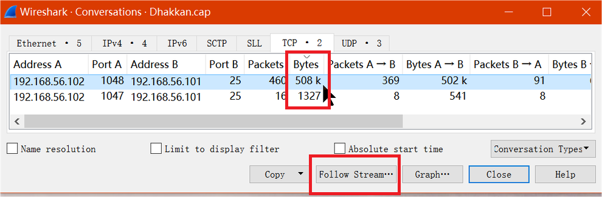
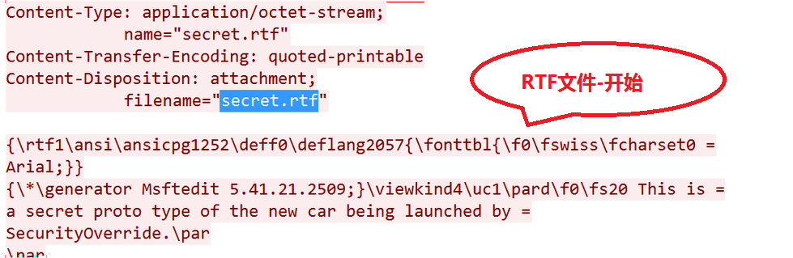
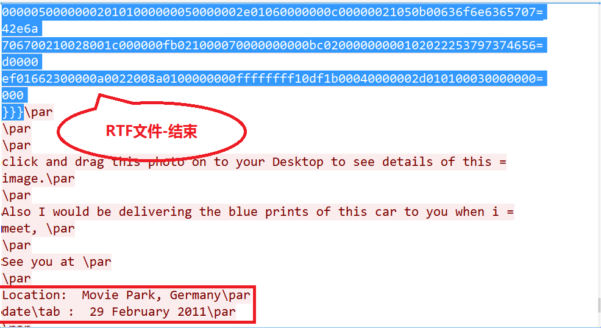
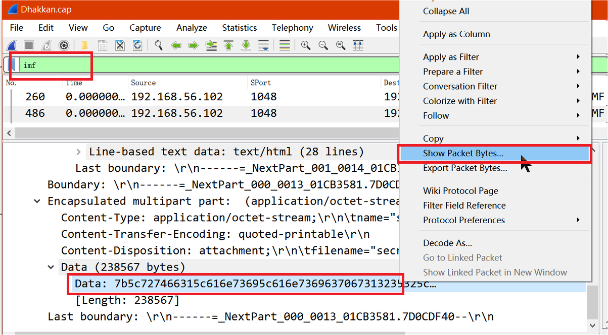
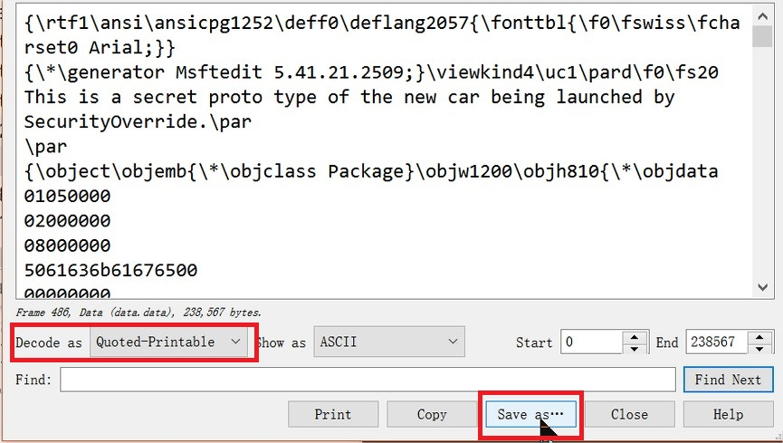
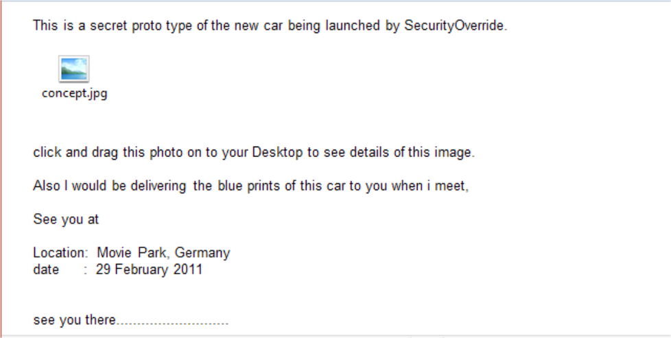

## Wireshark之提取图像

### 描述

> 提供捕获到的流量数据包，其中包含邮件以及附件

### 要求

> 分析并从附件中提取图像并找到以下详细信息
>
> 1. 图像的MD5值
> 2. 地址
> 3. 日期

### 步骤

1. 在数据包很多的情况下，定位关键数据包的一种实用方法是查看TCP对话并根据传输字节大小进行排序，选择具有最大字节数的会话后，单击`Follow Stream`以打开该TCP流

   

2. 在检查TCP流之后，我们推断出以下内容

   - E-mail sender:` Dhakkan@securityoverride.com`
   - E-mail recipient: `hacku@dhakkansecurity.com`
   - Subject: `The secret Concept Car Photo`
   - Content-Transfer-Encoding: `quoted-printable`
   - Attachment name and format: `secret.rtf (Rich Text Format)`
   - 

   > 正如我们从收集的信息中看到的那样，电子邮件以可引用的可打印格式编码，附件采用rtf格式

   

3. 从提供的跟踪文件中提取附件

   

   - 方法一：直接复制该数据段另存为RTF文件

   - 方法二：使用`imf`作为显示过滤器并前往所选IMF数据包的数据包详细信息窗格，展开并定位到`Data`段，右键单击转到`Show Packet Bytes`选项，选择解密选项`Quoted-Printable`，然后保存为`secret.rtf`

     

     

4. 打开文件提取图像

   

5. 生成图片的MD5值

   `certutil -hashfile concept.jpg MD5`

   `md5sum concept.jpg`

### 总结

1. 在解码时可以选择使用Python脚本或[在线网站](https://www.motobit.com/util/quoted-printable-decoder.asp)

   ```python
   #!/usr/bin/python
   import os, quopri
   encodedFile=open('secret.rtf')
   decodedFile=open('decoded_secret.rtf', 'wb')
   quopri.decode(encodedFile, decodedFile)
   ```

2. 获取到的信息：

   - 图像的MD5值： `3796102e17ff50382cb48160b76a3946`
   - 地址： `Movie Park, Germany`
   - 日期： `29 February 2011`

