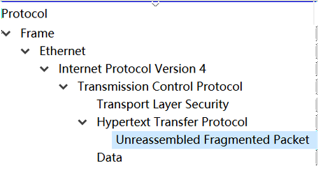
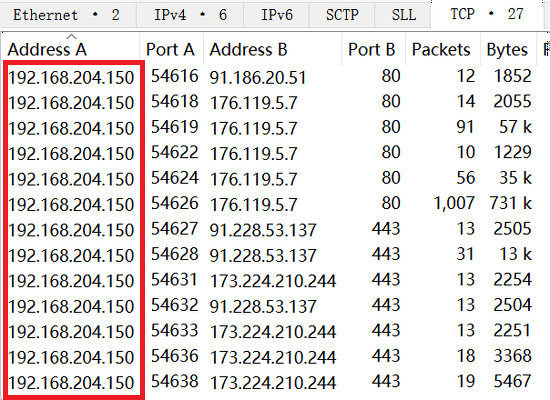
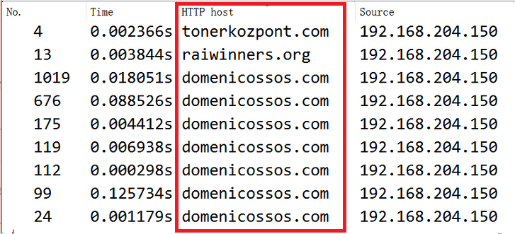
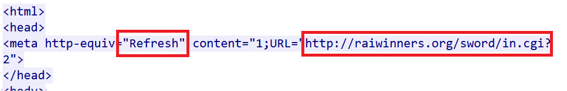
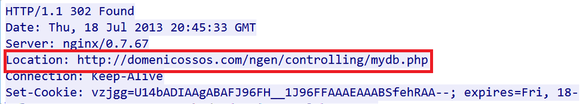
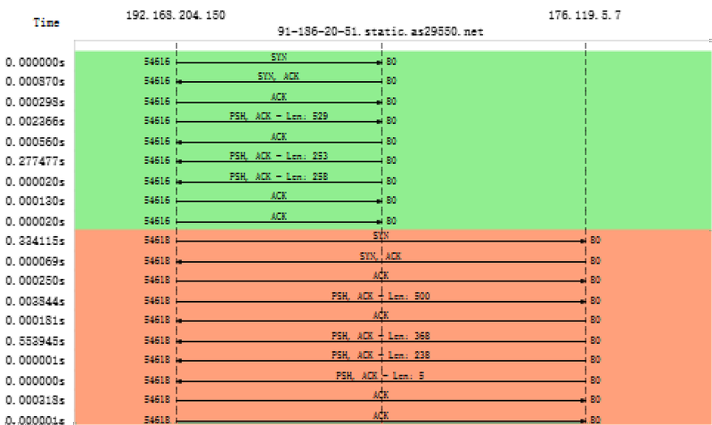
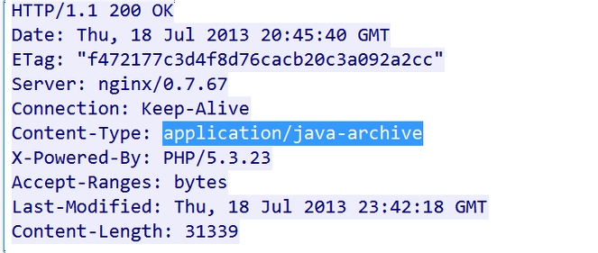
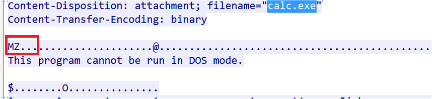
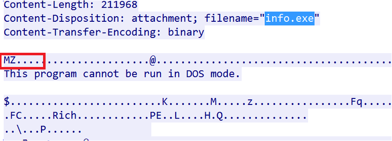
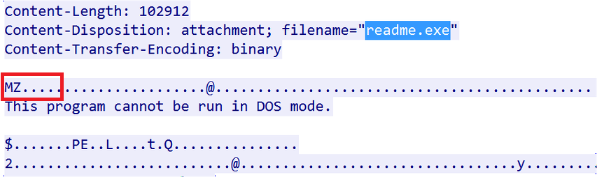

## 分析包含受感染流量的捕获文件

### [下载实验流量包](http://www.malware-traffic-analysis.net/2013/07/21/index.html)

### 查看流量包中使用的协议

`Statistics`→ `Protocol Hierarchy`

### 查看受感染的IP地址

- `Statistics`→ `Conversations`

- 显示过滤器：`http.request`[^1]

  

> 如果跟踪文件包含任何DNS或DHCP流量，则可以通过过滤NBNS / DNS流量`[dns.qry.name]`或DHCP流量`[bootp.option.hostname]`来找到受害者的主机名

### 不寻常的端口

​	通过分析，我们可以清楚地看到主机总共使用三个端口，即`80`、`443`和`16471`，其中`16471`看起来很奇怪，通过 Google 搜索得知它是 Blackhole漏洞利用工具包提供的 ZeroAccess Trojan常用端口之一

> 可以使用在线资源来验证是否有任何域/ URL或IP地址被列入黑名单：
>
> - [malwares](https://www.malwares.com/)
> - [virustotal](https://www.virustotal.com/)

### 找到感染源

​	在分析了上面的细节之后我们可以得出结论，客户端通过HTTP协议访问了一个恶意网站，导致受到感染。为了确定客户访问的网站或域，我们首先需要检查跟踪文件中存在的所有域或连接点

​	但是由于此跟踪文件中没有DNS流量，因此我们可以通过过滤`HTTP`流量来查看访问的域。在这种情况下，以下显示过滤器很有用：

- `http.request`
- `http.host`

​	通过分析每一个域的流量，发现用户访问`http://tonerkozpont.com`时被重定向到`http://raiwinners.org`站点

​	跟踪重定向连接，我们注意到在`HTTP 302`响应中通过`Location`头再次重定向到`domenicossos.com`站点

> 可以在`Statistics`菜单下的`Flow Graph`图中看到受感染网站的另一个重定向，该图表明客户端最初访问了`91.186.20.51`，此IP地址已解析为`http://tonerkozpont.com`
>
> 

### 提取传输的文件

​	Follow HTTP流量，发现有4个文件在网络上传输

1. 
2. 
3. 
4. 

### 分析文件

​	提交文件到[virustotal](https://www.virustotal.com/)网站上检测

### 总结

​	客户端/受害者（`192.168.204.150`）访问了一个受感染的网站（`http:// tonerkozpont.com`），该网站已将它进一步重定向到`mydb.php`页面上托管Blackhole漏洞利用工具包的网站（`domenicossos.com`）。然后可疑网站在受害者主机上下载了java exploit（`JavaArchive.jar`），然后传递了三个不同的有效负载（`calc.exe`、`info.exe`和`readme.exe`）。一旦被感染，就会发现额外的HTTPS流量，这些流量是针对`ohtheigh.cc`的多个子域进行的，此外还有到`16471`端口的流量

---

[^1]: 通过过滤数据包来查看是哪个IP地址发起请求，从而怀疑它是受感染的主机