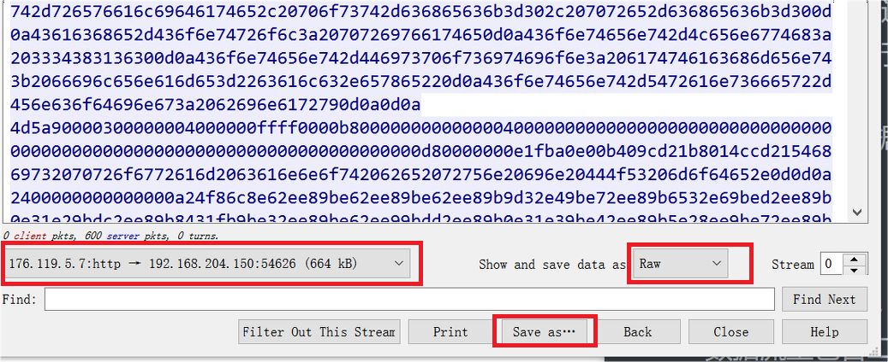

## Wireshark - 从pcaps提取二进制文件

### 提取包含二进制文件的流量包

 	通过显示过滤器过滤掉不相关的数据包，保存包含二进制文件的数据包，不仅可以缩小范围也可以进行备份

​	保存过滤后的数据包：`File`→`Export Specified Packets`

### 提取二进制文件

 1. 右键某数据包，点击`Follow Stream`，然后只显示一端向另一端发的数据，注意数据流里包含二进制文件

 2. 选择`Show and save data as` ：`Raw`

 3. 保存 `Save as...`，注意保存的文件格式与该二进制文件格式相同

    

	4.	使用Hex编辑器去掉多余的字段

