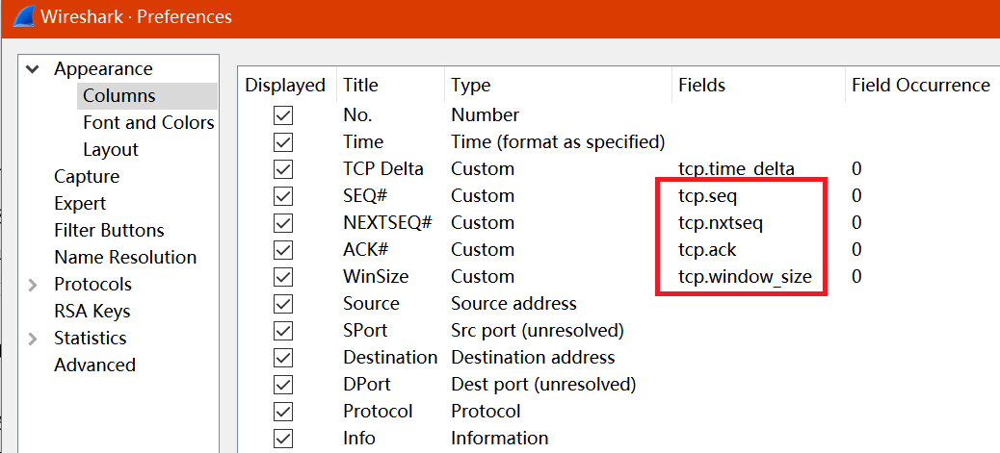
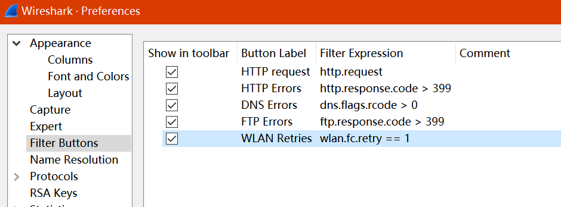

## Wireshark - 网络性能分析

​	如何保证网络正常运行和最佳性能是任何技术人员的主要关注点，影响它的问题可能是众多问题中的一个，并且完全取决于所讨论的网络的大小和复杂性，这些异常可包括以下内容但不限于此：

- 速度慢
- 数据包丢失或重传
- 带宽消耗过多
- 负载饱和

​      深入了解网络协议如何交织和工作对于排除网络性能问题是必不可少的前提。例如，如果我们不能有效地理解TCP流和错误控制机制，那么我们可能无法有效地测试基于TCP的性能问题，而使用Wireshark工具来对网络性能进行分析是我们不错的选择，下面是 Wireshark的一些有助于分析性能问题的功能：

- 专家信息窗口（Expert Infos Window）
- 图形（Graphs）
- 时间变化（Time variations）
- 着色规则（Colorization rules）

### 创建自定义配置文件[^1]

1. 取消选中/禁用`Allow subdissector to reassemble TCP streams`选项
   只应在获取HTTP或SMB对象时启用此选项

2. 要处理TCP中的排序问题，我们首先需要在`Preferences`→`Protocols`→`TCP`中启用`Analyze TCP sequence numbers`选项

3. 将序列号，下一个序列号和确认号放入Wireshark的三个不同显示列中，以便于分析TCP排序

   

4. 在查找网络延迟时，"时间"始终是一个主要因素，因此我们首先需要调整它。导航到`View`→`Time Display Format`勾选`Seconds since previously displayed packet`选项来更改时间的显示格式

5. 启用以下显示过滤器按钮

   

### 基于TCP的问题

​	`Expert Infos`选项卡可以很好地指示由于TCP问题而出现的任何问题，
同时我们还可以使用显示过滤器`tcp.analysis.flags`来缩小 Wireshark 识别的任何TCP问题，以下是一些常见的TCP问题及其各自的显示过滤器：

- 未捕获上一个段（t`cp.analysis.lost_segment`）
- 重复ACK（`tcp.analysis.duplicate_ack`）
- TCP快速重传（`tcp.analysis.fast_retransmission`）
- TCP重传（`tcp.analysis.retransmission`）
- 无序段（`tcp.analysis.out_of_order`）
- 零窗口（`tcp.analysis.zero_window`）

> - 每当数据包在网络上丢失时，我们都会注意到线路上的快速重传或重传，根据一般的经验认为重复的ACK会导致快速重传，并且发送方的过期请求超时（RTO）也会导致重新传输
>
> - 每当Wireshark检测到TCP会话的任何一方将TCP窗口大小值（`tcp.window_size_value == 0`）设为0时，它将该数据包标记为零窗口，并且当收件人的接收缓冲区无法跟上数据接收速率时，也会导致此情况。但需要注意的是：如果数据包的`RST`，`SYN`或`FIN`位设置为1，它们将不会被标记为Zero窗口

---

[^1]: 创建配置文件以便进行故障排除